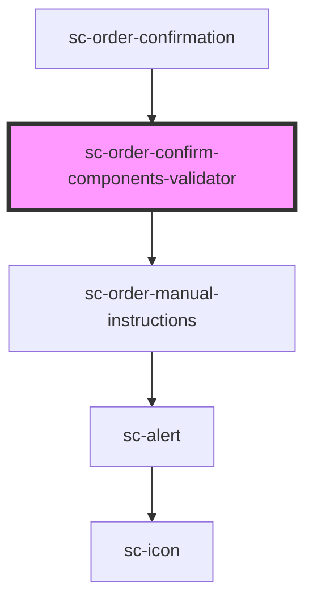

# sc-order-confirm-components-validator

<!-- Auto Generated Below -->

## Properties

| Property   | Attribute | Description  | Type       | Default     |
| ---------- | --------- | ------------ | ---------- | ----------- |
| `checkout` | --        | The checkout | `Checkout` | `undefined` |

## Dependencies

### Used by

 - [sc-order-confirmation](../../controllers/confirmation/order-confirmation)

### Depends on

- [sc-order-manual-instructions](../../controllers/confirmation/manual-instructions)

### Graph

----------------------------------------------

*Built with [StencilJS](https://stenciljs.com/)*
