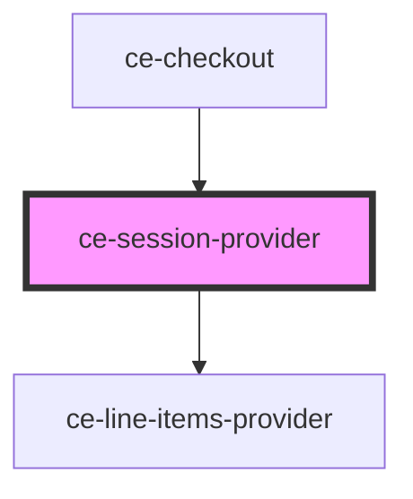

# ce-cart-provider

<!-- Auto Generated Below -->

## Properties

| Property          | Attribute       | Description                                 | Type                      | Default     |
| ----------------- | --------------- | ------------------------------------------- | ------------------------- | ----------- |
| `checkoutSession` | --              | CheckoutSession Object                      | `CheckoutSession`         | `undefined` |
| `currencyCode`    | `currency-code` | Currency Code                               | `string`                  | `'usd'`     |
| `groupId`         | `group-id`      | Group id                                    | `string`                  | `undefined` |
| `persist`         | `persist`       | Should we persist the session.              | `boolean`                 | `undefined` |
| `prices`          | --              | An array of prices to pre-fill in the form. | `PriceChoice[]`           | `[]`        |
| `setState`        | --              | Set the checkout state                      | `(state: string) => void` | `undefined` |

## Events

| Event             | Description             | Type                                                                                          |
| ----------------- | ----------------------- | --------------------------------------------------------------------------------------------- |
| `ceError`         | Update line items event | `CustomEvent<{ message: string; code?: string; data?: any; additional_errors?: any; } \| {}>` |
| `ceOnPaid`        | Update line items event | `CustomEvent<string>`                                                                         |
| `ceUpdateSession` | Update line items event | `CustomEvent<CheckoutSession>`                                                                |

## Dependencies

### Used by

 - [ce-checkout](../../controllers/checkout)

### Depends on

- [ce-line-items-provider](../line-items-provider)

### Graph

----------------------------------------------

*Built with [StencilJS](https://stenciljs.com/)*
