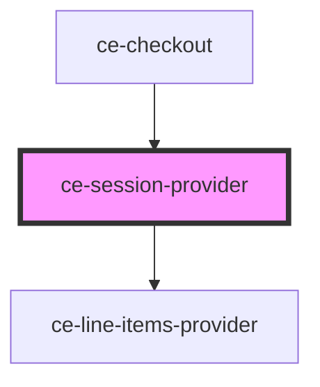

# ce-cart-provider

<!-- Auto Generated Below -->

## Properties

| Property       | Attribute       | Description                                 | Type                      | Default     |
| -------------- | --------------- | ------------------------------------------- | ------------------------- | ----------- |
| `currencyCode` | `currency-code` | Currency Code                               | `string`                  | `'usd'`     |
| `formId`       | `form-id`       | The checkout form id                        | `number`                  | `undefined` |
| `groupId`      | `group-id`      | Group id                                    | `string`                  | `undefined` |
| `mode`         | `mode`          | Are we in test or live mode.                | `"live" \| "test"`        | `'live'`    |
| `modified`     | `modified`      | Whent the post was modified.                | `string`                  | `undefined` |
| `order`        | --              | Order Object                                | `Order`                   | `undefined` |
| `persist`      | `persist`       | Should we persist the session.              | `boolean`                 | `undefined` |
| `prices`       | --              | An array of prices to pre-fill in the form. | `PriceChoice[]`           | `[]`        |
| `setState`     | --              | Set the checkout state                      | `(state: string) => void` | `undefined` |

## Events

| Event                | Description             | Type                                                                                          |
| -------------------- | ----------------------- | --------------------------------------------------------------------------------------------- |
| `ceError`            | Update line items event | `CustomEvent<{ message: string; code?: string; data?: any; additional_errors?: any; } \| {}>` |
| `cePaid`             | Paid event              | `CustomEvent<void>`                                                                           |
| `ceSetState`         | Set the state           | `CustomEvent<string>`                                                                         |
| `ceUpdateDraftState` | Update line items event | `CustomEvent<Order>`                                                                          |
| `ceUpdateOrderState` | Update line items event | `CustomEvent<Order>`                                                                          |

## Dependencies

### Used by

 - [ce-checkout](../../controllers/checkout-form/checkout)

### Depends on

- [ce-line-items-provider](../line-items-provider)

### Graph

----------------------------------------------

*Built with [StencilJS](https://stenciljs.com/)*
