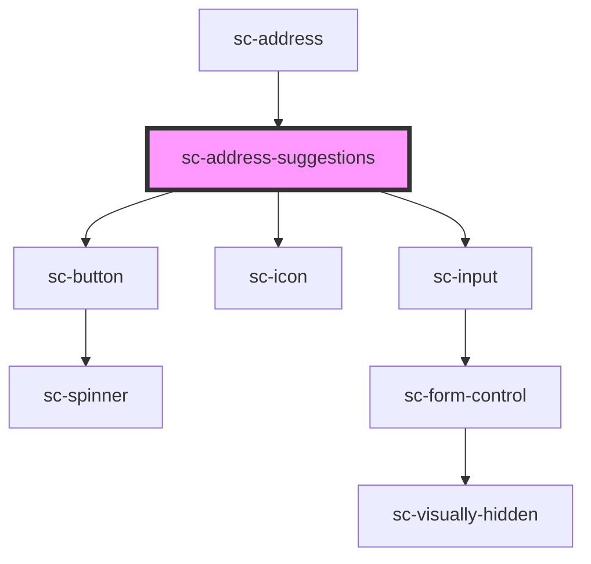

# sc-address-suggestions

<!-- Auto Generated Below -->

## Properties

| Property          | Attribute          | Description                            | Type                                                                                                                                                                                                                                                                                                                                                                            | Default                                                                                                                                                                                                                            |
| ----------------- | ------------------ | -------------------------------------- | ------------------------------------------------------------------------------------------------------------------------------------------------------------------------------------------------------------------------------------------------------------------------------------------------------------------------------------------------------------------------------- | ---------------------------------------------------------------------------------------------------------------------------------------------------------------------------------------------------------------------------------- |
| `address`         | --                 |                                        | `{ name?: string; line_1?: string; line_2?: string; city?: string; state?: string; postal_code?: string; country?: string; constructor?: Function; toString?: () => string; toLocaleString?: () => string; valueOf?: () => Object; hasOwnProperty?: (v: PropertyKey) => boolean; isPrototypeOf?: (v: Object) => boolean; propertyIsEnumerable?: (v: PropertyKey) => boolean; }` | `{     country: null,     city: null,     line_1: null,     line_2: null,     postal_code: null,     state: null,   }`                                                                                                             |
| `disabled`        | `disabled`         | If the address input is disabled       | `boolean`                                                                                                                                                                                                                                                                                                                                                                       | `false`                                                                                                                                                                                                                            |
| `inputProps`      | --                 | Props for the input element            | `{ [x: string]: unknown; }`                                                                                                                                                                                                                                                                                                                                                     | `{}`                                                                                                                                                                                                                               |
| `label`           | `label`            | The label for the address input        | `string`                                                                                                                                                                                                                                                                                                                                                                        | `__('Address', 'surecart')`                                                                                                                                                                                                        |
| `names`           | --                 |                                        | `{ name?: string; line_1?: string; line_2?: string; city?: string; state?: string; postal_code?: string; country?: string; constructor?: Function; toString?: () => string; toLocaleString?: () => string; valueOf?: () => Object; hasOwnProperty?: (v: PropertyKey) => boolean; isPrototypeOf?: (v: Object) => boolean; propertyIsEnumerable?: (v: PropertyKey) => boolean; }` | `{     name: 'shipping_name',     country: 'shipping_country',     city: 'shipping_city',     line_1: 'shipping_line_1',     line_2: 'shipping_line_2',     postal_code: 'shipping_postal_code',     state: 'shipping_state',   }` |
| `regions`         | --                 | Holds the regions for a given country. | `{ value: string; label: string; }[]`                                                                                                                                                                                                                                                                                                                                           | `[]`                                                                                                                                                                                                                               |
| `required`        | `required`         | If the address is required             | `boolean`                                                                                                                                                                                                                                                                                                                                                                       | `true`                                                                                                                                                                                                                             |
| `showSuggestions` | `show-suggestions` | Show address suggestions               | `boolean`                                                                                                                                                                                                                                                                                                                                                                       | `false`                                                                                                                                                                                                                            |

## Events

| Event                     | Description                           | Type                   |
| ------------------------- | ------------------------------------- | ---------------------- |
| `scChange`                | Event to update address               | `CustomEvent<void>`    |
| `scChangeAddress`         | Place select event                    | `CustomEvent<Address>` |
| `scHideAddressFields`     | Event to hide address fields          | `CustomEvent<void>`    |
| `scInput`                 | On input change                       | `CustomEvent<void>`    |
| `scShowAddressFields`     | Event to show address fields manually | `CustomEvent<void>`    |
| `scShowSuggestionsChange` | Show suggestions change event         | `CustomEvent<boolean>` |

## Shadow Parts

| Part                 | Description |
| -------------------- | ----------- |
| `"base"`             |             |
| `"manually"`         |             |
| `"no-result"`        |             |
| `"powered-by"`       |             |
| `"suggestion-item"`  |             |
| `"suggestions"`      |             |
| `"suggestions-list"` |             |

## Dependencies

### Used by

 - [sc-address](../address)

### Depends on

- [sc-button](../button)
- [sc-icon](../icon)
- [sc-input](../input)

### Graph

----------------------------------------------

*Built with [StencilJS](https://stenciljs.com/)*
