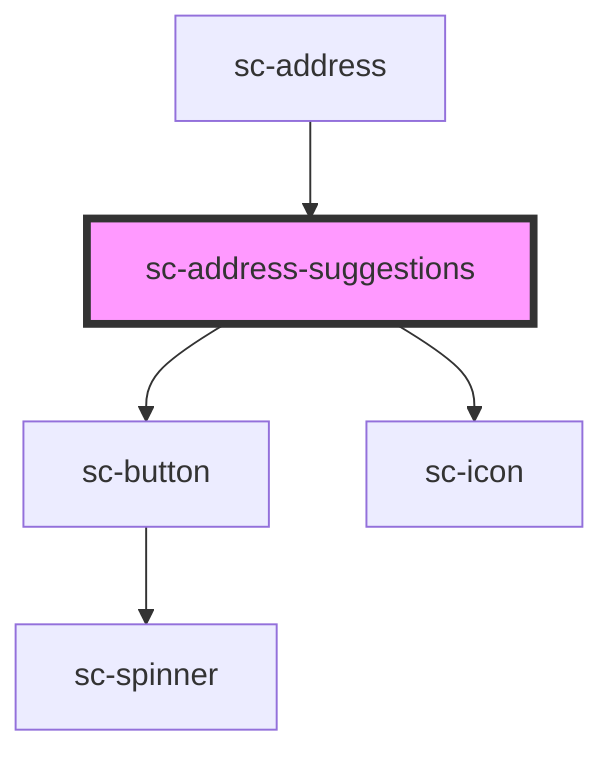

# sc-address-suggestions

<!-- Auto Generated Below -->

## Properties

| Property          | Attribute          | Description                            | Type                                                                                                                                                                                                                                                                                                                                                                            | Default                                                                                                                |
| ----------------- | ------------------ | -------------------------------------- | ------------------------------------------------------------------------------------------------------------------------------------------------------------------------------------------------------------------------------------------------------------------------------------------------------------------------------------------------------------------------------- | ---------------------------------------------------------------------------------------------------------------------- |
| `address`         | --                 |                                        | `{ name?: string; line_1?: string; line_2?: string; city?: string; state?: string; postal_code?: string; country?: string; constructor?: Function; toString?: () => string; toLocaleString?: () => string; valueOf?: () => Object; hasOwnProperty?: (v: PropertyKey) => boolean; isPrototypeOf?: (v: Object) => boolean; propertyIsEnumerable?: (v: PropertyKey) => boolean; }` | `{     country: null,     city: null,     line_1: null,     line_2: null,     postal_code: null,     state: null,   }` |
| `addressLine1`    | `address-line-1`   | Address line 1                         | `string`                                                                                                                                                                                                                                                                                                                                                                        | `''`                                                                                                                   |
| `isManually`      | `is-manually`      | Address line 2                         | `boolean`                                                                                                                                                                                                                                                                                                                                                                       | `false`                                                                                                                |
| `regions`         | --                 | Holds the regions for a given country. | `{ value: string; label: string; }[]`                                                                                                                                                                                                                                                                                                                                           | `undefined`                                                                                                            |
| `showSuggestions` | `show-suggestions` | Show address suggestions               | `boolean`                                                                                                                                                                                                                                                                                                                                                                       | `false`                                                                                                                |

## Events

| Event                     | Description                           | Type                   |
| ------------------------- | ------------------------------------- | ---------------------- |
| `scChangeAddress`         | Place select event                    | `CustomEvent<Address>` |
| `scShowAddressFields`     | Event to show address fields manually | `CustomEvent<void>`    |
| `scShowSuggestionsChange` | Show suggestions change event         | `CustomEvent<boolean>` |

## Shadow Parts

| Part                 | Description |
| -------------------- | ----------- |
| `"base"`             |             |
| `"suggestion-item"`  |             |
| `"suggestions"`      |             |
| `"suggestions-list"` |             |

## Dependencies

### Used by

 - [sc-address](../address)

### Depends on

- [sc-button](../button)
- [sc-icon](../icon)

### Graph

----------------------------------------------

*Built with [StencilJS](https://stenciljs.com/)*
