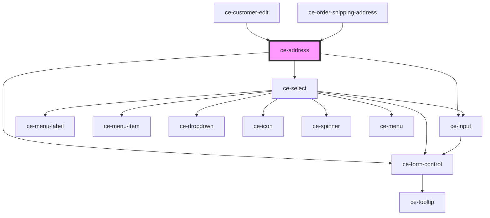

# ce-address

<!-- Auto Generated Below -->

## Properties

| Property   | Attribute  | Description              | Type                                                                                                                                                                                                                                                                                                                                                                            | Default                                                                                                                                                                                                    |
| ---------- | ---------- | ------------------------ | ------------------------------------------------------------------------------------------------------------------------------------------------------------------------------------------------------------------------------------------------------------------------------------------------------------------------------------------------------------------------------- | ---------------------------------------------------------------------------------------------------------------------------------------------------------------------------------------------------------- |
| `address`  | --         | The address.             | `{ name?: string; line_1?: string; line_2?: string; city?: string; state?: string; postal_code?: string; country?: string; constructor?: Function; toString?: () => string; toLocaleString?: () => string; valueOf?: () => Object; hasOwnProperty?: (v: PropertyKey) => boolean; isPrototypeOf?: (v: Object) => boolean; propertyIsEnumerable?: (v: PropertyKey) => boolean; }` | `{     country: '',     city: '',     line_1: '',     line_2: '',     postal_code: '',     state: '',   }`                                                                                                 |
| `label`    | `label`    | The label for the field. | `string`                                                                                                                                                                                                                                                                                                                                                                        | `undefined`                                                                                                                                                                                                |
| `loading`  | `loading`  | Is this loading?         | `boolean`                                                                                                                                                                                                                                                                                                                                                                       | `true`                                                                                                                                                                                                     |
| `names`    | --         |                          | `{ name?: string; line_1?: string; line_2?: string; city?: string; state?: string; postal_code?: string; country?: string; constructor?: Function; toString?: () => string; toLocaleString?: () => string; valueOf?: () => Object; hasOwnProperty?: (v: PropertyKey) => boolean; isPrototypeOf?: (v: Object) => boolean; propertyIsEnumerable?: (v: PropertyKey) => boolean; }` | `{     country: 'shipping_country',     city: 'shipping_country',     line_1: 'shipping_line_1',     line_2: 'shipping_line_2',     postal_code: 'shipping_postal_code',     state: 'shipping_state',   }` |
| `required` | `required` | Is this required?        | `boolean`                                                                                                                                                                                                                                                                                                                                                                       | `true`                                                                                                                                                                                                     |

## Shadow Parts

| Part        | Description |
| ----------- | ----------- |
| `"control"` |             |

## Dependencies

### Used by

 - [ce-customer-edit](../../controllers/dashboard/customer-edit)
 - [ce-order-shipping-address](../../controllers/order-shipping-address)

### Depends on

- [ce-form-control](../form-control)
- [ce-select](../select)
- [ce-input](../input)

### Graph

----------------------------------------------

*Built with [StencilJS](https://stenciljs.com/)*
