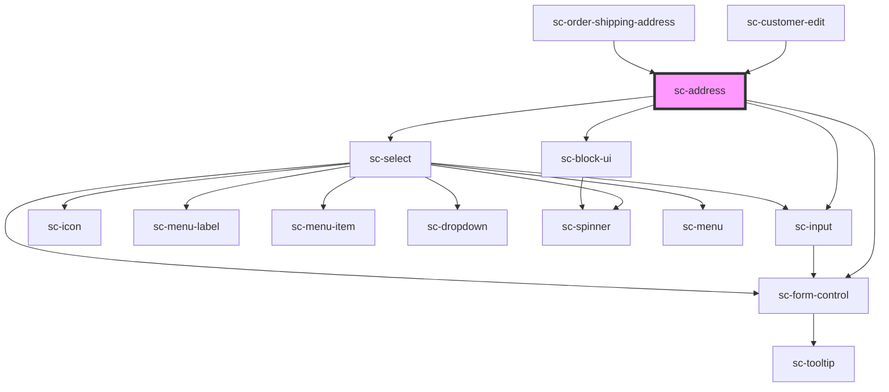

# ce-address

<!-- Auto Generated Below -->

## Properties

| Property          | Attribute          | Description                | Type                                                                                                                                                                                                                                                                                                                                                                            | Default                                                                                                                                                                                                                                                                                                                          |
| ----------------- | ------------------ | -------------------------- | ------------------------------------------------------------------------------------------------------------------------------------------------------------------------------------------------------------------------------------------------------------------------------------------------------------------------------------------------------------------------------- | -------------------------------------------------------------------------------------------------------------------------------------------------------------------------------------------------------------------------------------------------------------------------------------------------------------------------------- |
| `address`         | --                 | The address.               | `{ name?: string; line_1?: string; line_2?: string; city?: string; state?: string; postal_code?: string; country?: string; constructor?: Function; toString?: () => string; toLocaleString?: () => string; valueOf?: () => Object; hasOwnProperty?: (v: PropertyKey) => boolean; isPrototypeOf?: (v: Object) => boolean; propertyIsEnumerable?: (v: PropertyKey) => boolean; }` | `{     country: null,     city: null,     line_1: null,     line_2: null,     postal_code: null,     state: null,   }`                                                                                                                                                                                                           |
| `disabled`        | `disabled`         | Is this disabled?          | `boolean`                                                                                                                                                                                                                                                                                                                                                                       | `undefined`                                                                                                                                                                                                                                                                                                                      |
| `label`           | `label`            | The label for the field.   | `string`                                                                                                                                                                                                                                                                                                                                                                        | `undefined`                                                                                                                                                                                                                                                                                                                      |
| `loading`         | `loading`          | Is this loading?           | `boolean`                                                                                                                                                                                                                                                                                                                                                                       | `false`                                                                                                                                                                                                                                                                                                                          |
| `namePlaceholder` | `name-placeholder` | Placeholder for Name       | `string`                                                                                                                                                                                                                                                                                                                                                                        | `undefined`                                                                                                                                                                                                                                                                                                                      |
| `names`           | --                 |                            | `{ name?: string; line_1?: string; line_2?: string; city?: string; state?: string; postal_code?: string; country?: string; constructor?: Function; toString?: () => string; toLocaleString?: () => string; valueOf?: () => Object; hasOwnProperty?: (v: PropertyKey) => boolean; isPrototypeOf?: (v: Object) => boolean; propertyIsEnumerable?: (v: PropertyKey) => boolean; }` | `{     name: 'shipping_name',     country: 'shipping_country',     city: 'shipping_city',     line_1: 'shipping_line_1',     line_2: 'shipping_line_2',     postal_code: 'shipping_postal_code',     state: 'shipping_state',   }`                                                                                               |
| `placeholders`    | --                 |                            | `{ name?: string; line_1?: string; line_2?: string; city?: string; state?: string; postal_code?: string; country?: string; constructor?: Function; toString?: () => string; toLocaleString?: () => string; valueOf?: () => Object; hasOwnProperty?: (v: PropertyKey) => boolean; isPrototypeOf?: (v: Object) => boolean; propertyIsEnumerable?: (v: PropertyKey) => boolean; }` | `{     name: __('Name or Company Name', 'surecart'),     country: __('Country', 'surecart'),     city: __('City', 'surecart'),     line_1: __('Address', 'surecart'),     line_2: __('Address Line 2', 'surecart'),     postal_code: __('Postal Code/Zip', 'surecart'),     state: __('State/Province/Region', 'surecart'),   }` |
| `required`        | `required`         | Is this required?          | `boolean`                                                                                                                                                                                                                                                                                                                                                                       | `true`                                                                                                                                                                                                                                                                                                                           |
| `showLine2`       | `show-line-2`      | Should we show name field? | `boolean`                                                                                                                                                                                                                                                                                                                                                                       | `undefined`                                                                                                                                                                                                                                                                                                                      |
| `showName`        | `show-name`        | Should we show name field? | `boolean`                                                                                                                                                                                                                                                                                                                                                                       | `undefined`                                                                                                                                                                                                                                                                                                                      |

## Events

| Event             | Description           | Type                                                                                                                                                                                                                                                                                                                                                                                         |
| ----------------- | --------------------- | -------------------------------------------------------------------------------------------------------------------------------------------------------------------------------------------------------------------------------------------------------------------------------------------------------------------------------------------------------------------------------------------- |
| `scChangeAddress` | Address change event. | `CustomEvent<{ name?: string; line_1?: string; line_2?: string; city?: string; state?: string; postal_code?: string; country?: string; constructor?: Function; toString?: () => string; toLocaleString?: () => string; valueOf?: () => Object; hasOwnProperty?: (v: PropertyKey) => boolean; isPrototypeOf?: (v: Object) => boolean; propertyIsEnumerable?: (v: PropertyKey) => boolean; }>` |
| `scInputAddress`  | Address change event. | `CustomEvent<{ name?: string; line_1?: string; line_2?: string; city?: string; state?: string; postal_code?: string; country?: string; constructor?: Function; toString?: () => string; toLocaleString?: () => string; valueOf?: () => Object; hasOwnProperty?: (v: PropertyKey) => boolean; isPrototypeOf?: (v: Object) => boolean; propertyIsEnumerable?: (v: PropertyKey) => boolean; }>` |

## Methods

### `reportValidity() => Promise<boolean>`

#### Returns

Type: `Promise<boolean>`

## Shadow Parts

| Part        | Description |
| ----------- | ----------- |
| `"control"` |             |

## Dependencies

### Used by

 - [sc-customer-edit](../../controllers/dashboard/customer-edit)
 - [sc-order-shipping-address](../../controllers/checkout-form/order-shipping-address)

### Depends on

- [sc-form-control](../form-control)
- [sc-input](../input)
- [sc-select](../select)
- [sc-block-ui](../block-ui)

### Graph

----------------------------------------------

*Built with [StencilJS](https://stenciljs.com/)*
