# ce-alert

<!-- Auto Generated Below -->

## Properties

| Property       | Attribute        | Description                                                                                                                                                                                                           | Type                                                        | Default     |
| -------------- | ---------------- | --------------------------------------------------------------------------------------------------------------------------------------------------------------------------------------------------------------------- | ----------------------------------------------------------- | ----------- |
| `closable`     | `closable`       | Makes the alert closable.                                                                                                                                                                                             | `boolean`                                                   | `false`     |
| `duration`     | `duration`       | The length of time, in milliseconds, the alert will show before closing itself. If the user interacts with the alert before it closes (e.g. moves the mouse over it), the timer will restart. Defaults to `Infinity`. | `number`                                                    | `Infinity`  |
| `noIcon`       | `no-icon`        | No icon                                                                                                                                                                                                               | `boolean`                                                   | `undefined` |
| `open`         | `open`           | Indicates whether or not the alert is open. You can use this in lieu of the show/hide methods.                                                                                                                        | `boolean`                                                   | `false`     |
| `scrollMargin` | `scroll-margin`  | Scroll margin                                                                                                                                                                                                         | `string`                                                    | `'0px'`     |
| `scrollOnOpen` | `scroll-on-open` | Scroll into view.                                                                                                                                                                                                     | `boolean`                                                   | `undefined` |
| `type`         | `type`           | The type of alert.                                                                                                                                                                                                    | `"danger" \| "info" \| "primary" \| "success" \| "warning"` | `'primary'` |

## Events

| Event    | Description          | Type                |
| -------- | -------------------- | ------------------- |
| `scHide` | When alert is hidden | `CustomEvent<void>` |
| `scShow` | When alert is shown  | `CustomEvent<void>` |

## Methods

### `hide() => Promise<void>`

Hides the alert

#### Returns

Type: `Promise<void>`

### `show() => Promise<void>`

Shows the alert.

#### Returns

Type: `Promise<void>`

## Shadow Parts

| Part           | Description |
| -------------- | ----------- |
| `"base"`       |             |
| `"close-icon"` |             |
| `"icon"`       |             |
| `"message"`    |             |
| `"text"`       |             |
| `"title"`      |             |

## Dependencies

### Used by

 - [sc-cart-form](../../controllers/cart/sc-cart-form)
 - [sc-checkout](../../controllers/checkout-form/checkout)
 - [sc-coupon-form](../coupon-form)
 - [sc-custom-order-price-input](../../controllers/checkout-form/custom-order-price-input)
 - [sc-dashboard-module](../dashboard-module)
 - [sc-error](../error)
 - [sc-form-error-provider](../../providers/form-error-provider)
 - [sc-login-form](../../controllers/login)
 - [sc-login-provider](../../providers/sc-login-provider)
 - [sc-order-confirmation](../../controllers/confirmation/order-confirmation)
 - [sc-order-manual-instructions](../../controllers/confirmation/manual-instructions)
 - [sc-password-nag](../../controllers/dashboard/sc-password-nag)
 - [sc-payment](../../controllers/checkout-form/payment)
 - [sc-paypal-add-method](../sc-paypal-add-method)
 - [sc-price-choice](../../controllers/checkout-form/price-choice)
 - [sc-stripe-add-method](../sc-stripe-add-method)
 - [sc-stripe-payment-request](../stripe-payment-request)
 - [sc-subscription-cancel](../../controllers/dashboard/subscription-cancel)
 - [sc-subscription-renew](../../controllers/dashboard/subscription-renew)
 - [sc-subscription-switch](../../controllers/dashboard/subscription-switch)
 - [sc-upcoming-invoice](../../controllers/dashboard/upcoming-invoice)

### Depends on

- [sc-icon](../icon)

### Graph

```mermaid
graph TD;
  sc-alert --> sc-icon
  sc-cart-form --> sc-alert
  sc-checkout --> sc-alert
  sc-coupon-form --> sc-alert
  sc-custom-order-price-input --> sc-alert
  sc-dashboard-module --> sc-alert
  sc-error --> sc-alert
  sc-form-error-provider --> sc-alert
  sc-login-form --> sc-alert
  sc-login-provider --> sc-alert
  sc-order-confirmation --> sc-alert
  sc-order-manual-instructions --> sc-alert
  sc-password-nag --> sc-alert
  sc-payment --> sc-alert
  sc-paypal-add-method --> sc-alert
  sc-price-choice --> sc-alert
  sc-stripe-add-method --> sc-alert
  sc-stripe-payment-request --> sc-alert
  sc-subscription-cancel --> sc-alert
  sc-subscription-renew --> sc-alert
  sc-subscription-switch --> sc-alert
  sc-upcoming-invoice --> sc-alert
  style sc-alert fill:#f9f,stroke:#333,stroke-width:4px
```

----------------------------------------------

*Built with [StencilJS](https://stenciljs.com/)*
