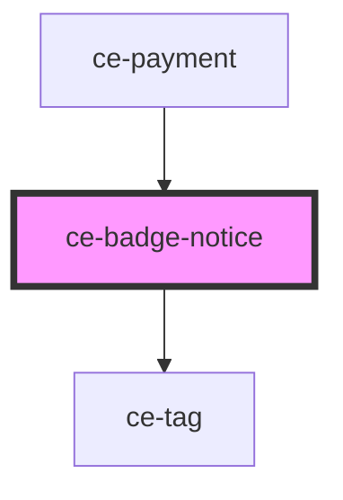

# ce-badge-notice

<!-- Auto Generated Below -->

## Properties

| Property | Attribute | Description | Type                                                                  | Default     |
| -------- | --------- | ----------- | --------------------------------------------------------------------- | ----------- |
| `label`  | `label`   |             | `string`                                                              | `undefined` |
| `size`   | `size`    |             | `"large" \| "medium" \| "small"`                                      | `'small'`   |
| `type`   | `type`    |             | `"danger" \| "info" \| "primary" \| "success" \| "text" \| "warning"` | `'primary'` |

## Dependencies

### Used by

 - [ce-payment](../../controllers/payment)

### Depends on

- [ce-tag](../tag)

### Graph

----------------------------------------------

*Built with [StencilJS](https://stenciljs.com/)*
