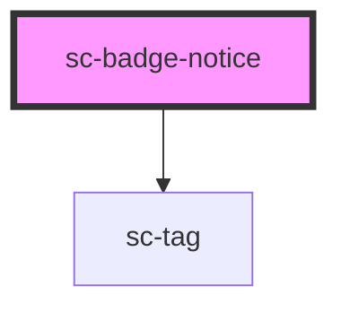

# ce-badge-notice

<!-- Auto Generated Below -->

## Properties

| Property | Attribute | Description | Type                                                                     | Default     |
| -------- | --------- | ----------- | ------------------------------------------------------------------------ | ----------- |
| `label`  | `label`   |             | `string`                                                                 | `undefined` |
| `size`   | `size`    |             | `"large" \| "medium" \| "small"`                                         | `'small'`   |
| `type`   | `type`    |             | `"danger" \| "default" \| "info" \| "primary" \| "success" \| "warning"` | `'primary'` |

## Dependencies

### Depends on

- [sc-tag](../tag)

### Graph

----------------------------------------------

*Built with [StencilJS](https://stenciljs.com/)*
