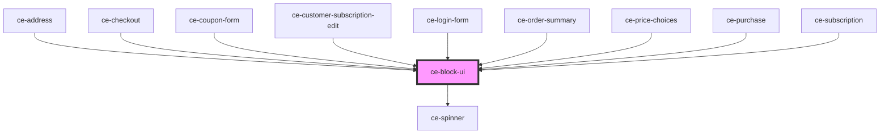

# ce-block-ui

<!-- Auto Generated Below -->

## Properties

| Property      | Attribute     | Description | Type      | Default     |
| ------------- | ------------- | ----------- | --------- | ----------- |
| `spinner`     | `spinner`     |             | `boolean` | `undefined` |
| `transparent` | `transparent` |             | `boolean` | `undefined` |
| `zIndex`      | `z-index`     |             | `number`  | `1`         |

## Dependencies

### Used by

 - [ce-address](../ce-address)
 - [ce-checkout](../../controllers/checkout)
 - [ce-coupon-form](../../controllers/coupon-form)
 - [ce-customer-subscription-edit](../../controllers/dashboard/subscription-detail)
 - [ce-login-form](../../controllers/login)
 - [ce-order-summary](../../controllers/order-summary)
 - [ce-price-choices](../../controllers/price-choices)
 - [ce-purchase](../../controllers/purchase)
 - [ce-subscription](../../controllers/dashboard/subscription)

### Depends on

- [ce-spinner](../spinner)

### Graph

----------------------------------------------

*Built with [StencilJS](https://stenciljs.com/)*
