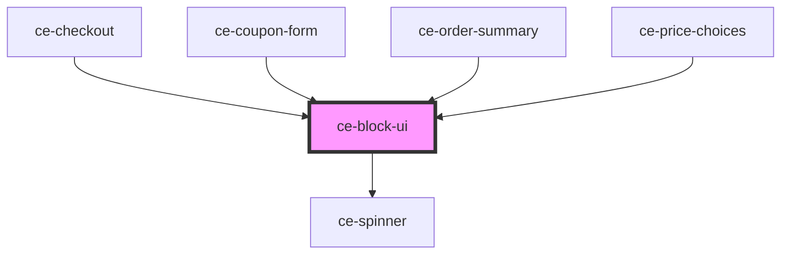

# ce-block-ui

<!-- Auto Generated Below -->

## Properties

| Property | Attribute | Description | Type     | Default |
| -------- | --------- | ----------- | -------- | ------- |
| `zIndex` | `z-index` |             | `number` | `1`     |

## Dependencies

### Used by

 - [ce-checkout](../../controllers/checkout)
 - [ce-coupon-form](../../controllers/coupon-form)
 - [ce-order-summary](../../controllers/order-summary)
 - [ce-price-choices](../../controllers/price-chooser)

### Depends on

- [ce-spinner](../spinner)

### Graph

----------------------------------------------

*Built with [StencilJS](https://stenciljs.com/)*
