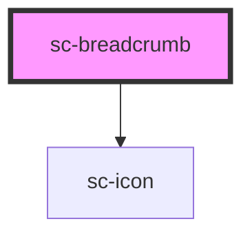

# ce-breadcrumb

<!-- Auto Generated Below -->

## Properties

| Property | Attribute | Description                                                                                                                                                            | Type                                         | Default                 |
| -------- | --------- | ---------------------------------------------------------------------------------------------------------------------------------------------------------------------- | -------------------------------------------- | ----------------------- |
| `href`   | `href`    | Optional URL to direct the user to when the breadcrumb item is activated. When set, a link will be rendered internally. When unset, a button will be rendered instead. | `string`                                     | `undefined`             |
| `rel`    | `rel`     | The `rel` attribute to use on the link. Only used when `href` is set.                                                                                                  | `string`                                     | `'noreferrer noopener'` |
| `target` | `target`  | Tells the browser where to open the link. Only used when `href` is set.                                                                                                | `"_blank" \| "_parent" \| "_self" \| "_top"` | `undefined`             |

## Shadow Parts

| Part          | Description |
| ------------- | ----------- |
| `"base"`      |             |
| `"label"`     |             |
| `"prefix"`    |             |
| `"separator"` |             |
| `"suffix"`    |             |

## Dependencies

### Depends on

- [sc-icon](../icon)

### Graph

----------------------------------------------

*Built with [StencilJS](https://stenciljs.com/)*
