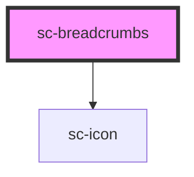

# ce-breadcrumbs

<!-- Auto Generated Below -->

## Properties

| Property | Attribute | Description                                                                                                                                  | Type     | Default        |
| -------- | --------- | -------------------------------------------------------------------------------------------------------------------------------------------- | -------- | -------------- |
| `label`  | `label`   | The label to use for the breadcrumb control. This will not be shown, but it will be announced by screen readers and other assistive devices. | `string` | `'Breadcrumb'` |

## Shadow Parts

| Part     | Description |
| -------- | ----------- |
| `"base"` |             |

## Dependencies

### Depends on

- [sc-icon](../icon)

### Graph

----------------------------------------------

*Built with [StencilJS](https://stenciljs.com/)*
