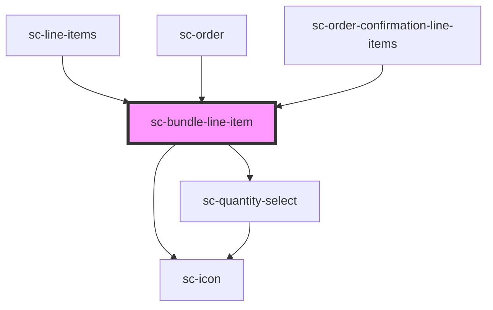

# sc-bundle-line-item

<!-- Auto Generated Below -->

## Overview

Renders a bundle parent line item with its component items nested inside.

## Properties

| Property     | Attribute   | Description                  | Type         | Default     |
| ------------ | ----------- | ---------------------------- | ------------ | ----------- |
| `components` | --          | The component line items.    | `LineItem[]` | `[]`        |
| `editable`   | `editable`  | Is the line item editable?   | `boolean`    | `false`     |
| `item`       | --          | The bundle parent line item. | `LineItem`   | `undefined` |
| `max`        | `max`       | Max quantity.                | `number`     | `undefined` |
| `removable`  | `removable` | Is the line item removable?  | `boolean`    | `false`     |

## Events

| Event              | Description                        | Type                  |
| ------------------ | ---------------------------------- | --------------------- |
| `scRemove`         | Emitted when the item is removed.  | `CustomEvent<void>`   |
| `scUpdateQuantity` | Emitted when the quantity changes. | `CustomEvent<number>` |

## Shadow Parts

| Part                   | Description                  |
| ---------------------- | ---------------------------- |
| `"base"`               | The component base           |
| `"bundle-line-item"`   | The bundle line item wrapper |
| `"component"`          | A single bundle component    |
| `"components"`         | The bundle components list   |
| `"image"`              | The bundle product image     |
| `"placeholder__image"` |                              |
| `"price"`              | The bundle price             |
| `"savings"`            | The savings badge            |
| `"static-quantity"`    |                              |
| `"title"`              | The bundle product title     |

## Dependencies

### Used by

 - [sc-line-items](../../controllers/checkout-form/line-items)
 - [sc-order](../../controllers/dashboard/order)
 - [sc-order-confirmation-line-items](../../controllers/confirmation/order-confirmation-line-items)

### Depends on

- [sc-icon](../icon)
- [sc-quantity-select](../quantity-select)

### Graph

----------------------------------------------

*Built with [StencilJS](https://stenciljs.com/)*
