# ce-button

<!-- Auto Generated Below -->

## Properties

| Property   | Attribute  | Description                                                                                            | Type                                                                                         | Default     |
| ---------- | ---------- | ------------------------------------------------------------------------------------------------------ | -------------------------------------------------------------------------------------------- | ----------- |
| `busy`     | `busy`     | Draws the button in a busy state.                                                                      | `boolean`                                                                                    | `false`     |
| `caret`    | `caret`    | Draws the button with a caret for use with dropdowns, popovers, etc.                                   | `boolean`                                                                                    | `false`     |
| `circle`   | `circle`   | Draws a circle button.                                                                                 | `boolean`                                                                                    | `false`     |
| `disabled` | `disabled` | Disables the button.                                                                                   | `boolean`                                                                                    | `false`     |
| `download` | `download` | Tells the browser to download the linked file as this filename. Only used when `href` is set.          | `string`                                                                                     | `undefined` |
| `full`     | `full`     | Draws the button full-width.                                                                           | `boolean`                                                                                    | `false`     |
| `href`     | `href`     | When set, the underlying button will be rendered as an `<a>` with this `href` instead of a `<button>`. | `string`                                                                                     | `undefined` |
| `loading`  | `loading`  | Draws the button in a loading state.                                                                   | `boolean`                                                                                    | `false`     |
| `name`     | `name`     | An optional name for the button. Ignored when `href` is set.                                           | `string`                                                                                     | `undefined` |
| `outline`  | `outline`  | Draws an outlined button.                                                                              | `boolean`                                                                                    | `false`     |
| `pill`     | `pill`     | Draws a pill-style button with rounded edges.                                                          | `boolean`                                                                                    | `false`     |
| `size`     | `size`     | The button's size.                                                                                     | `"large" \| "medium" \| "small"`                                                             | `'medium'`  |
| `submit`   | `submit`   | Indicates if activating the button should submit the form. Ignored when `href` is set.                 | `boolean`                                                                                    | `false`     |
| `target`   | `target`   | Tells the browser where to open the link. Only used when `href` is set.                                | `"_blank" \| "_parent" \| "_self" \| "_top"`                                                 | `undefined` |
| `type`     | `type`     | The button's type.                                                                                     | `"danger" \| "default" \| "info" \| "link" \| "primary" \| "success" \| "text" \| "warning"` | `'default'` |
| `value`    | `value`    | An optional value for the button. Ignored when `href` is set.                                          | `string`                                                                                     | `undefined` |

## Events

| Event     | Description                          | Type                |
| --------- | ------------------------------------ | ------------------- |
| `ceBlur`  | Emitted when the button loses focus. | `CustomEvent<void>` |
| `ceFocus` | Emitted when the button gains focus. | `CustomEvent<void>` |

## Shadow Parts

| Part       | Description |
| ---------- | ----------- |
| `"base"`   |             |
| `"caret"`  |             |
| `"label"`  |             |
| `"prefix"` |             |
| `"suffix"` |             |

## Dependencies

### Used by

 - [ce-charges-list](../../controllers/dashboard/charges-list)
 - [ce-coupon-form](../coupon-form)
 - [ce-customer-details](../customer-details)
 - [ce-customer-edit](../../controllers/dashboard/customer-edit)
 - [ce-donation-choices](../../controllers/checkout-form/ce-donation-choices)
 - [ce-downloads-list](../downloads-list)
 - [ce-invoices-list](../../controllers/dashboard/invoices-list)
 - [ce-login-form](../../controllers/login)
 - [ce-order-submit](../../controllers/checkout-form/order-submit)
 - [ce-orders-list](../../controllers/dashboard/orders-list)
 - [ce-pagination](../pagination)
 - [ce-payment-method-create](../../controllers/dashboard/payment-method-create)
 - [ce-payment-methods-list](../../controllers/dashboard/payment-methods-list)
 - [ce-subscription](../../controllers/dashboard/subscription)
 - [ce-subscription-cancel](../../controllers/dashboard/subscription-cancel)
 - [ce-subscription-payment](../../controllers/dashboard/subscription-payment)
 - [ce-subscription-renew](../../controllers/dashboard/subscription-renew)
 - [ce-subscription-switch](../../controllers/dashboard/subscription-switch)
 - [ce-subscriptions-list](../../controllers/dashboard/subscriptions-list)
 - [ce-tax-id-input](../tax-id-input)
 - [ce-upcoming-invoice](../../controllers/dashboard/upcoming-invoice)
 - [ce-wordpress-password-edit](../../controllers/dashboard/wordpress-password-edit)
 - [ce-wordpress-user](../../controllers/dashboard/wordpress-user)
 - [ce-wordpress-user-edit](../../controllers/dashboard/wordpress-user-edit)

### Depends on

- [ce-spinner](../spinner)

### Graph

```mermaid
graph TD;
  ce-button --> ce-spinner
  ce-charges-list --> ce-button
  ce-coupon-form --> ce-button
  ce-customer-details --> ce-button
  ce-customer-edit --> ce-button
  ce-donation-choices --> ce-button
  ce-downloads-list --> ce-button
  ce-invoices-list --> ce-button
  ce-login-form --> ce-button
  ce-order-submit --> ce-button
  ce-orders-list --> ce-button
  ce-pagination --> ce-button
  ce-payment-method-create --> ce-button
  ce-payment-methods-list --> ce-button
  ce-subscription --> ce-button
  ce-subscription-cancel --> ce-button
  ce-subscription-payment --> ce-button
  ce-subscription-renew --> ce-button
  ce-subscription-switch --> ce-button
  ce-subscriptions-list --> ce-button
  ce-tax-id-input --> ce-button
  ce-upcoming-invoice --> ce-button
  ce-wordpress-password-edit --> ce-button
  ce-wordpress-user --> ce-button
  ce-wordpress-user-edit --> ce-button
  style ce-button fill:#f9f,stroke:#333,stroke-width:4px
```

----------------------------------------------

*Built with [StencilJS](https://stenciljs.com/)*
