# ce-card

<!-- Auto Generated Below -->

## Properties

| Property     | Attribute    | Description              | Type      | Default     |
| ------------ | ------------ | ------------------------ | --------- | ----------- |
| `borderless` | `borderless` | Is this card borderless. | `boolean` | `undefined` |
| `loading`    | `loading`    | Is this card loading.    | `boolean` | `undefined` |
| `noDivider`  | `no-divider` | Eliminate the divider    | `boolean` | `undefined` |
| `noPadding`  | `no-padding` | Remove padding           | `boolean` | `undefined` |

## Shadow Parts

| Part     | Description |
| -------- | ----------- |
| `"base"` |             |

## Dependencies

### Used by

 - [ce-charges-list](../../controllers/dashboard/charges-list)
 - [ce-customer-details](../../controllers/dashboard/ce-customer-details)
 - [ce-customer-edit](../../controllers/dashboard/ce-customer-edit)
 - [ce-invoices-list](../../controllers/dashboard/invoices-list)
 - [ce-login-form](../../controllers/login)
 - [ce-orders-list](../../controllers/dashboard/orders-list)
 - [ce-payment-method-create](../../controllers/dashboard/payment-method-create)
 - [ce-payment-methods-list](../../controllers/dashboard/payment-methods-list)
 - [ce-subscription](../../controllers/dashboard/subscription)
 - [ce-subscription-cancel](../../controllers/dashboard/ce-subscription-cancel)
 - [ce-subscription-payment](../../controllers/dashboard/ce-subscription-payment)
 - [ce-subscription-renew](../../controllers/dashboard/ce-subscription-renew)
 - [ce-subscriptions-list](../../controllers/dashboard/subscriptions-list)
 - [ce-upcoming-invoice](../../controllers/dashboard/upcoming-invoice)

### Graph

```mermaid
graph TD;
  ce-charges-list --> ce-card
  ce-customer-details --> ce-card
  ce-customer-edit --> ce-card
  ce-invoices-list --> ce-card
  ce-login-form --> ce-card
  ce-orders-list --> ce-card
  ce-payment-method-create --> ce-card
  ce-payment-methods-list --> ce-card
  ce-subscription --> ce-card
  ce-subscription-cancel --> ce-card
  ce-subscription-payment --> ce-card
  ce-subscription-renew --> ce-card
  ce-subscriptions-list --> ce-card
  ce-upcoming-invoice --> ce-card
  style ce-card fill:#f9f,stroke:#333,stroke-width:4px
```

----------------------------------------------

*Built with [StencilJS](https://stenciljs.com/)*
