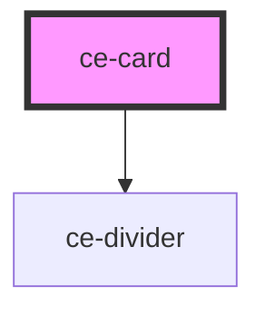

# ce-card

<!-- Auto Generated Below -->

## Properties

| Property     | Attribute    | Description | Type      | Default     |
| ------------ | ------------ | ----------- | --------- | ----------- |
| `borderless` | `borderless` |             | `boolean` | `undefined` |

## Shadow Parts

| Part       | Description |
| ---------- | ----------- |
| `"base"`   |             |
| `"border"` |             |

## Dependencies

### Depends on

- [ce-divider](../divider)

### Graph

----------------------------------------------

*Built with [StencilJS](https://stenciljs.com/)*
