# ce-card

<!-- Auto Generated Below -->

## Properties

| Property     | Attribute    | Description              | Type      | Default     |
| ------------ | ------------ | ------------------------ | --------- | ----------- |
| `borderless` | `borderless` | Is this card borderless. | `boolean` | `undefined` |
| `loading`    | `loading`    | Is this card loading.    | `boolean` | `undefined` |
| `noDivider`  | `no-divider` | Eliminate the divider    | `boolean` | `undefined` |
| `noPadding`  | `no-padding` | Remove padding           | `boolean` | `undefined` |

## Shadow Parts

| Part     | Description |
| -------- | ----------- |
| `"base"` |             |

## Dependencies

### Used by

 - [sc-charges-list](../../controllers/dashboard/charges-list)
 - [sc-customer-details](../customer-details)
 - [sc-customer-edit](../../controllers/dashboard/customer-edit)
 - [sc-downloads-list](../downloads-list)
 - [sc-invoices-list](../../controllers/dashboard/invoices-list)
 - [sc-login-form](../../controllers/login)
 - [sc-orders-list](../../controllers/dashboard/orders-list)
 - [sc-payment](../../controllers/checkout-form/payment)
 - [sc-payment-method-create](../../controllers/dashboard/payment-method-create)
 - [sc-payment-methods-list](../../controllers/dashboard/payment-methods-list)
 - [sc-subscription](../../controllers/dashboard/subscription)
 - [sc-subscription-ad-hoc-confirm](../../controllers/dashboard/subscription-ad-hoc-confirm)
 - [sc-subscription-cancel](../../controllers/dashboard/subscription-cancel)
 - [sc-subscription-payment](../../controllers/dashboard/subscription-payment)
 - [sc-subscription-renew](../../controllers/dashboard/subscription-renew)
 - [sc-subscriptions-list](../../controllers/dashboard/subscriptions-list)
 - [sc-upcoming-invoice](../../controllers/dashboard/upcoming-invoice)
 - [sc-wordpress-password-edit](../../controllers/dashboard/wordpress-password-edit)
 - [sc-wordpress-user](../../controllers/dashboard/wordpress-user)
 - [sc-wordpress-user-edit](../../controllers/dashboard/wordpress-user-edit)

### Graph

```mermaid
graph TD;
  sc-charges-list --> sc-card
  sc-customer-details --> sc-card
  sc-customer-edit --> sc-card
  sc-downloads-list --> sc-card
  sc-invoices-list --> sc-card
  sc-login-form --> sc-card
  sc-orders-list --> sc-card
  sc-payment --> sc-card
  sc-payment-method-create --> sc-card
  sc-payment-methods-list --> sc-card
  sc-subscription --> sc-card
  sc-subscription-ad-hoc-confirm --> sc-card
  sc-subscription-cancel --> sc-card
  sc-subscription-payment --> sc-card
  sc-subscription-renew --> sc-card
  sc-subscriptions-list --> sc-card
  sc-upcoming-invoice --> sc-card
  sc-wordpress-password-edit --> sc-card
  sc-wordpress-user --> sc-card
  sc-wordpress-user-edit --> sc-card
  style sc-card fill:#f9f,stroke:#333,stroke-width:4px
```

----------------------------------------------

*Built with [StencilJS](https://stenciljs.com/)*
