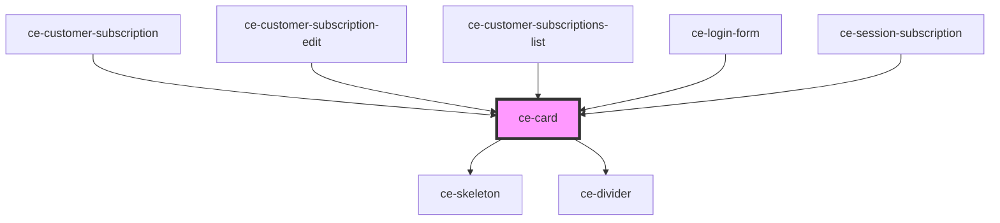

# ce-card

<!-- Auto Generated Below -->

## Properties

| Property     | Attribute    | Description | Type      | Default     |
| ------------ | ------------ | ----------- | --------- | ----------- |
| `borderless` | `borderless` |             | `boolean` | `undefined` |
| `loading`    | `loading`    |             | `boolean` | `undefined` |

## Shadow Parts

| Part       | Description |
| ---------- | ----------- |
| `"base"`   |             |
| `"border"` |             |

## Dependencies

### Used by

 - [ce-customer-subscription](../../controllers/dashboard/customer-subscription)
 - [ce-customer-subscription-edit](../../controllers/dashboard/customer-subscription-edit)
 - [ce-customer-subscriptions-list](../../controllers/dashboard/customer-subscriptions-list)
 - [ce-login-form](../../controllers/login)
 - [ce-session-subscription](../../controllers/session-subscription)

### Depends on

- [ce-skeleton](../skeleton)
- [ce-divider](../divider)

### Graph

----------------------------------------------

*Built with [StencilJS](https://stenciljs.com/)*
