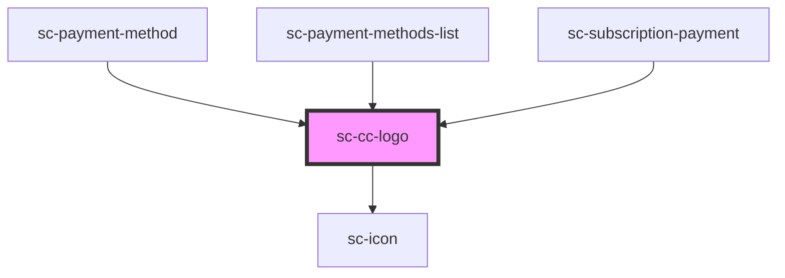

# ce-cc-logo

<!-- Auto Generated Below -->

## Properties

| Property | Attribute | Description | Type     | Default     |
| -------- | --------- | ----------- | -------- | ----------- |
| `brand`  | `brand`   |             | `string` | `undefined` |

## Shadow Parts

| Part     | Description |
| -------- | ----------- |
| `"base"` |             |

## Dependencies

### Used by

 - [sc-payment-method](../sc-payment-method)
 - [sc-payment-methods-list](../../controllers/dashboard/payment-methods-list)
 - [sc-subscription-payment](../../controllers/dashboard/subscription-payment)

### Depends on

- [sc-icon](../icon)

### Graph

----------------------------------------------

*Built with [StencilJS](https://stenciljs.com/)*
