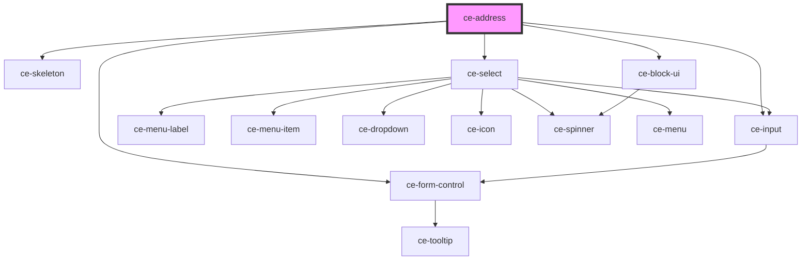

# ce-address

<!-- Auto Generated Below -->

## Properties

| Property          | Attribute  | Description | Type      | Default     |
| ----------------- | ---------- | ----------- | --------- | ----------- |
| `busy`            | `busy`     |             | `boolean` | `undefined` |
| `label`           | `label`    |             | `string`  | `undefined` |
| `loading`         | `loading`  |             | `boolean` | `undefined` |
| `required`        | `required` |             | `boolean` | `true`      |
| `shippingAddress` | --         |             | `Address` | `undefined` |

## Shadow Parts

| Part        | Description |
| ----------- | ----------- |
| `"control"` |             |

## Dependencies

### Depends on

- [ce-input](../input)
- [ce-form-control](../form-control)
- [ce-skeleton](../skeleton)
- [ce-select](../select)
- [ce-block-ui](../block-ui)

### Graph

----------------------------------------------

*Built with [StencilJS](https://stenciljs.com/)*
