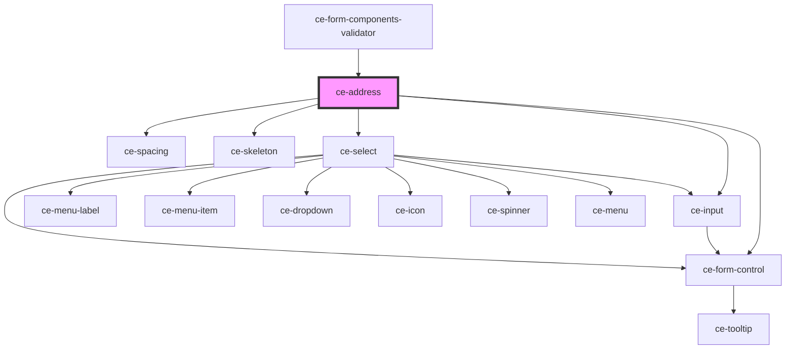

# ce-address

<!-- Auto Generated Below -->

## Properties

| Property                  | Attribute  | Description | Type      | Default     |
| ------------------------- | ---------- | ----------- | --------- | ----------- |
| `customerShippingAddress` | --         |             | `Address` | `{}`        |
| `label`                   | `label`    |             | `string`  | `undefined` |
| `loading`                 | `loading`  |             | `boolean` | `undefined` |
| `required`                | `required` |             | `boolean` | `true`      |
| `shippingAddress`         | --         |             | `Address` | `{}`        |

## Shadow Parts

| Part        | Description |
| ----------- | ----------- |
| `"control"` |             |

## Dependencies

### Used by

 - [ce-form-components-validator](../../providers/form-components-validator)

### Depends on

- [ce-input](../input)
- [ce-form-control](../form-control)
- [ce-spacing](../spacing)
- [ce-skeleton](../skeleton)
- [ce-select](../select)

### Graph

----------------------------------------------

*Built with [StencilJS](https://stenciljs.com/)*
