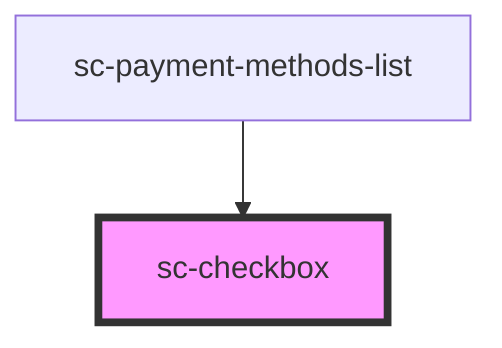

# ce-checkbox

<!-- Auto Generated Below -->

## Properties

| Property        | Attribute       | Description                                                                                               | Type      | Default     |
| --------------- | --------------- | --------------------------------------------------------------------------------------------------------- | --------- | ----------- |
| `checked`       | `checked`       | Draws the checkbox in a checked state.                                                                    | `boolean` | `false`     |
| `disabled`      | `disabled`      | Disables the checkbox.                                                                                    | `boolean` | `false`     |
| `edit`          | `edit`          | Makes this edit and not editable.                                                                         | `boolean` | `false`     |
| `indeterminate` | `indeterminate` | Draws the checkbox in an indeterminate state.                                                             | `boolean` | `false`     |
| `invalid`       | `invalid`       | This will be true when the control is in an invalid state. Validity is determined by the `required` prop. | `boolean` | `false`     |
| `name`          | `name`          | The checkbox's name attribute.                                                                            | `string`  | `undefined` |
| `required`      | `required`      | Makes the checkbox a required field.                                                                      | `boolean` | `false`     |
| `value`         | `value`         | The checkbox's value attribute.                                                                           | `string`  | `undefined` |

## Events

| Event      | Description                                       | Type                |
| ---------- | ------------------------------------------------- | ------------------- |
| `scBlur`   | Emitted when the control loses focus.             | `CustomEvent<void>` |
| `scChange` | Emitted when the control's checked state changes. | `CustomEvent<void>` |
| `scFocus`  | Emitted when the control gains focus.             | `CustomEvent<void>` |

## Methods

### `reportValidity() => Promise<boolean>`

Checks for validity and shows the browser's validation message if the control is invalid.

#### Returns

Type: `Promise<boolean>`

### `triggerBlur() => Promise<void>`

Removes focus from the checkbox.

#### Returns

Type: `Promise<void>`

### `triggerClick() => Promise<void>`

Simulates a click on the checkbox.

#### Returns

Type: `Promise<void>`

### `triggerFocus(options?: FocusOptions) => Promise<void>`

Sets focus on the checkbox.

#### Returns

Type: `Promise<void>`

## Shadow Parts

| Part                   | Description                |
| ---------------------- | -------------------------- |
| `"base"`               | The elements base wrapper. |
| `"checked-icon"`       | Checked icon.              |
| `"control"`            | The control wrapper.       |
| `"indeterminate-icon"` | Indeterminate icon.        |
| `"label"`              | The label.                 |

## Dependencies

### Used by

 - [sc-payment-methods-list](../../controllers/dashboard/payment-methods-list)

### Graph

----------------------------------------------

*Built with [StencilJS](https://stenciljs.com/)*
