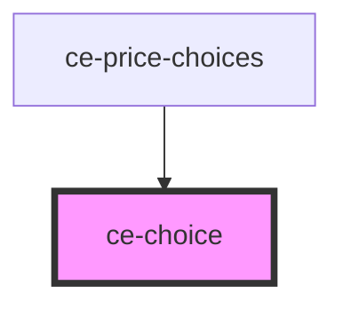

# ce-choice

<!-- Auto Generated Below -->

## Properties

| Property   | Attribute  | Description                                                                                               | Type                    | Default     |
| ---------- | ---------- | --------------------------------------------------------------------------------------------------------- | ----------------------- | ----------- |
| `checked`  | `checked`  | Draws the choice in a checked state.                                                                      | `boolean`               | `false`     |
| `disabled` | `disabled` | Is the choice disabled                                                                                    | `boolean`               | `false`     |
| `invalid`  | `invalid`  | This will be true when the control is in an invalid state. Validity is determined by the `required` prop. | `boolean`               | `false`     |
| `name`     | `name`     | The choice name attribute                                                                                 | `string`                | `undefined` |
| `required` | `required` | Is this required                                                                                          | `boolean`               | `false`     |
| `type`     | `type`     | The choice name attribute                                                                                 | `"checkbox" \| "radio"` | `'radio'`   |
| `value`    | `value`    | The choice value                                                                                          | `string`                | `undefined` |

## Events

| Event      | Description                                       | Type                   |
| ---------- | ------------------------------------------------- | ---------------------- |
| `ceBlur`   | Emitted when the control loses focus.             | `CustomEvent<void>`    |
| `ceChange` | Emitted when the control's checked state changes. | `CustomEvent<boolean>` |
| `ceFocus`  | Emitted when the control gains focus.             | `CustomEvent<void>`    |

## Methods

### `reportValidity() => Promise<boolean>`

Checks for validity and shows the browser's validation message if the control is invalid.

#### Returns

Type: `Promise<boolean>`

### `setCustomValidity(message: string) => Promise<void>`

Sets a custom validation message. If `message` is not empty, the field will be considered invalid.

#### Returns

Type: `Promise<void>`

### `triggerClick() => Promise<void>`

Simulates a click on the choice.

#### Returns

Type: `Promise<void>`

## Shadow Parts

| Part             | Description |
| ---------------- | ----------- |
| `"base"`         |             |
| `"checked-icon"` |             |
| `"control"`      |             |
| `"description"`  |             |
| `"label"`        |             |
| `"title"`        |             |

## Dependencies

### Used by

 - [ce-price-choices](../../controllers/price-chooser)

### Graph

----------------------------------------------

*Built with [StencilJS](https://stenciljs.com/)*
