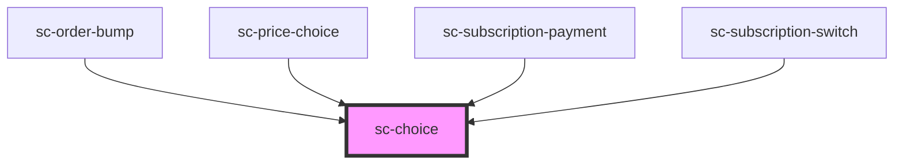

# ce-choice

<!-- Auto Generated Below -->

## Properties

| Property      | Attribute      | Description                                                                                               | Type                             | Default     |
| ------------- | -------------- | --------------------------------------------------------------------------------------------------------- | -------------------------------- | ----------- |
| `checked`     | `checked`      | Draws the choice in a checked state.                                                                      | `boolean`                        | `false`     |
| `disabled`    | `disabled`     | Is the choice disabled                                                                                    | `boolean`                        | `false`     |
| `invalid`     | `invalid`      | This will be true when the control is in an invalid state. Validity is determined by the `required` prop. | `boolean`                        | `false`     |
| `name`        | `name`         | The choice name attribute                                                                                 | `string`                         | `undefined` |
| `required`    | `required`     | Is this required                                                                                          | `boolean`                        | `false`     |
| `showControl` | `show-control` | Show the radio/checkbox control                                                                           | `boolean`                        | `true`      |
| `showLabel`   | `show-label`   | Show the label                                                                                            | `boolean`                        | `true`      |
| `showPrice`   | `show-price`   | Show the price                                                                                            | `boolean`                        | `true`      |
| `size`        | `size`         | The size.                                                                                                 | `"large" \| "medium" \| "small"` | `'medium'`  |
| `type`        | `type`         | The choice name attribute                                                                                 | `"checkbox" \| "radio"`          | `'radio'`   |
| `value`       | `value`        | The choice value                                                                                          | `string`                         | `undefined` |

## Events

| Event      | Description                                       | Type                   |
| ---------- | ------------------------------------------------- | ---------------------- |
| `scBlur`   | Emitted when the control loses focus.             | `CustomEvent<void>`    |
| `scChange` | Emitted when the control's checked state changes. | `CustomEvent<boolean>` |
| `scFocus`  | Emitted when the control gains focus.             | `CustomEvent<void>`    |

## Methods

### `reportValidity() => Promise<boolean>`

Checks for validity and shows the browser's validation message if the control is invalid.

#### Returns

Type: `Promise<boolean>`

### `setCustomValidity(message: string) => Promise<void>`

Sets a custom validation message. If `message` is not empty, the field will be considered invalid.

#### Returns

Type: `Promise<void>`

### `triggerClick() => Promise<void>`

Simulates a click on the choice.

#### Returns

Type: `Promise<void>`

## Shadow Parts

| Part             | Description |
| ---------------- | ----------- |
| `"base"`         |             |
| `"checked-icon"` |             |
| `"content"`      |             |
| `"control"`      |             |
| `"description"`  |             |
| `"label"`        |             |
| `"title"`        |             |

## Dependencies

### Used by

 - [sc-order-bump](../../controllers/checkout-form/sc-order-bump)
 - [sc-price-choice](../../controllers/checkout-form/price-choice)
 - [sc-subscription-payment](../../controllers/dashboard/subscription-payment)
 - [sc-subscription-switch](../../controllers/dashboard/subscription-switch)

### Graph

----------------------------------------------

*Built with [StencilJS](https://stenciljs.com/)*
