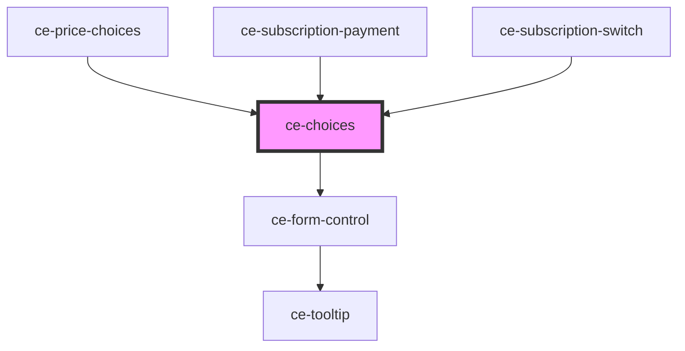

# ce-choices

<!-- Auto Generated Below -->

## Properties

| Property       | Attribute       | Description                                                                                             | Type                             | Default    |
| -------------- | --------------- | ------------------------------------------------------------------------------------------------------- | -------------------------------- | ---------- |
| `columns`      | `columns`       | Number of columns on desktop                                                                            | `number`                         | `1`        |
| `errorMessage` | `error-message` | Validation error message.                                                                               | `string`                         | `''`       |
| `help`         | `help`          | The input's help text.                                                                                  | `string`                         | `''`       |
| `hideLabel`    | `hide-label`    | Hides the fieldset and legend that surrounds the group. The label will still be read by screen readers. | `boolean`                        | `false`    |
| `label`        | `label`         | The group label. Required for proper accessibility. Alternatively, you can use the label slot.          | `string`                         | `''`       |
| `required`     | `required`      | Required                                                                                                | `boolean`                        | `false`    |
| `showLabel`    | `show-label`    | Should we show the label                                                                                | `boolean`                        | `true`     |
| `size`         | `size`          | Input size                                                                                              | `"large" \| "medium" \| "small"` | `'medium'` |

## Shadow Parts

| Part        | Description |
| ----------- | ----------- |
| `"base"`    |             |
| `"choices"` |             |

## Dependencies

### Used by

 - [ce-price-choices](../../controllers/price-choices)
 - [ce-subscription-payment](../../controllers/dashboard/ce-subscription-payment)
 - [ce-subscription-switch](../../controllers/dashboard/ce-subscription-switch)

### Depends on

- [ce-form-control](../form-control)

### Graph

----------------------------------------------

*Built with [StencilJS](https://stenciljs.com/)*
