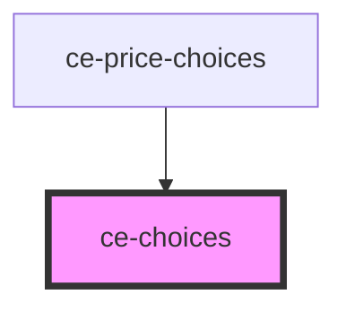

# ce-choices

<!-- Auto Generated Below -->

## Properties

| Property    | Attribute    | Description                                                                                             | Type      | Default |
| ----------- | ------------ | ------------------------------------------------------------------------------------------------------- | --------- | ------- |
| `columns`   | `columns`    |                                                                                                         | `number`  | `1`     |
| `hideLabel` | `hide-label` | Hides the fieldset and legend that surrounds the group. The label will still be read by screen readers. | `boolean` | `false` |
| `label`     | `label`      | The group label. Required for proper accessibility. Alternatively, you can use the label slot.          | `string`  | `''`    |

## Shadow Parts

| Part        | Description |
| ----------- | ----------- |
| `"base"`    |             |
| `"choices"` |             |
| `"label"`   |             |

## Dependencies

### Used by

 - [ce-price-choices](../../controllers/price-chooser)

### Graph

----------------------------------------------

*Built with [StencilJS](https://stenciljs.com/)*
