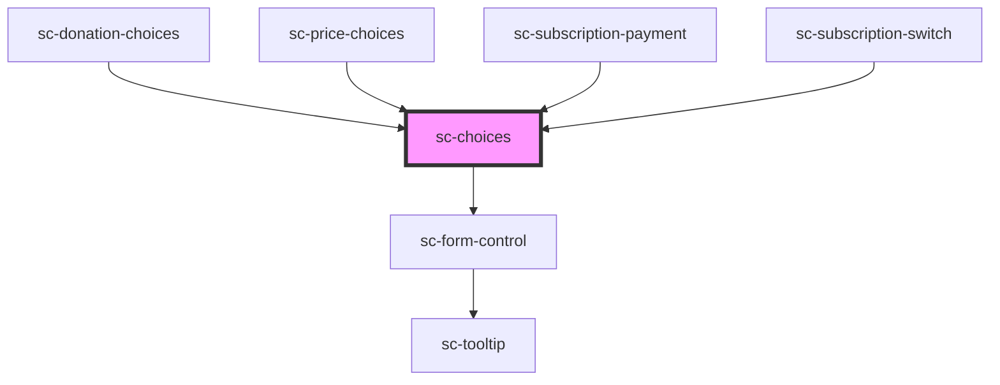

# ce-choices

<!-- Auto Generated Below -->

## Properties

| Property       | Attribute       | Description                                                                                             | Type                             | Default     |
| -------------- | --------------- | ------------------------------------------------------------------------------------------------------- | -------------------------------- | ----------- |
| `autoWidth`    | `auto-width`    |                                                                                                         | `boolean`                        | `undefined` |
| `columns`      | `columns`       | Number of columns on desktop                                                                            | `number`                         | `1`         |
| `errorMessage` | `error-message` | Validation error message.                                                                               | `string`                         | `''`        |
| `help`         | `help`          | The input's help text.                                                                                  | `string`                         | `''`        |
| `hideLabel`    | `hide-label`    | Hides the fieldset and legend that surrounds the group. The label will still be read by screen readers. | `boolean`                        | `false`     |
| `label`        | `label`         | The group label. Required for proper accessibility. Alternatively, you can use the label slot.          | `string`                         | `''`        |
| `required`     | `required`      | Required                                                                                                | `boolean`                        | `false`     |
| `showLabel`    | `show-label`    | Should we show the label                                                                                | `boolean`                        | `true`      |
| `size`         | `size`          | Input size                                                                                              | `"large" \| "medium" \| "small"` | `'medium'`  |

## Shadow Parts

| Part             | Description                                    |
| ---------------- | ---------------------------------------------- |
| `"base"`         | The elements base wrapper.                     |
| `"choices"`      | The choices wrapper.                           |
| `"form-control"` | The form control wrapper.                      |
| `"help-text"`    | Help text that describes how to use the input. |
| `"label"`        | The input label.                               |

## Dependencies

### Used by

 - [sc-donation-choices](../../controllers/checkout-form/donation-choices)
 - [sc-price-choices](../../controllers/checkout-form/price-choices)
 - [sc-subscription-payment](../../controllers/dashboard/subscription-payment)
 - [sc-subscription-switch](../../controllers/dashboard/subscription-switch)

### Depends on

- [sc-form-control](../form-control)

### Graph

----------------------------------------------

*Built with [StencilJS](https://stenciljs.com/)*
