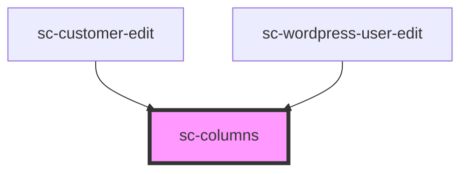

# ce-columns

<!-- Auto Generated Below -->

## Properties

| Property             | Attribute               | Description                            | Type      | Default     |
| -------------------- | ----------------------- | -------------------------------------- | --------- | ----------- |
| `isFullHeight`       | `is-full-height`        | Is this full vertical height           | `boolean` | `undefined` |
| `isReversedOnMobile` | `is-reversed-on-mobile` | Is this reverse ordered on mobile      | `boolean` | `undefined` |
| `isStackedOnMobile`  | `is-stacked-on-mobile`  | Is this stacked on mobile              | `boolean` | `undefined` |
| `verticalAlignment`  | `vertical-alignment`    | The vertical alignment of the columns. | `string`  | `undefined` |

## Dependencies

### Used by

 - [sc-customer-edit](../../controllers/dashboard/customer-edit)
 - [sc-wordpress-user-edit](../../controllers/dashboard/wordpress-user-edit)

### Graph

----------------------------------------------

*Built with [StencilJS](https://stenciljs.com/)*
