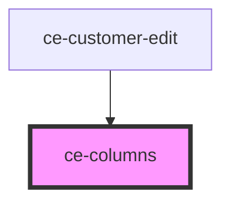

# ce-columns

<!-- Auto Generated Below -->

## Properties

| Property            | Attribute              | Description                            | Type      | Default     |
| ------------------- | ---------------------- | -------------------------------------- | --------- | ----------- |
| `isStackedOnMobile` | `is-stacked-on-mobile` | Is this stacked on mobile              | `boolean` | `undefined` |
| `verticalAlignment` | `vertical-alignment`   | The vertical alignment of the columns. | `string`  | `undefined` |

## Dependencies

### Used by

 - [ce-customer-edit](../../controllers/dashboard/ce-customer-edit)

### Graph

----------------------------------------------

*Built with [StencilJS](https://stenciljs.com/)*
