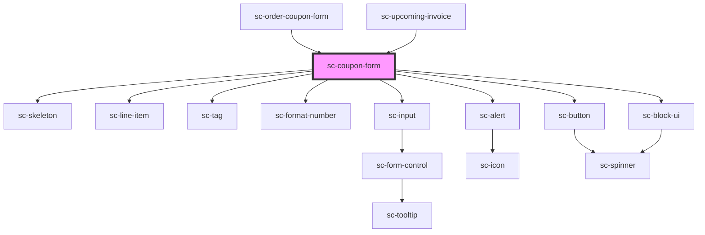

# ce-coupon-form

<!-- Auto Generated Below -->

## Properties

| Property         | Attribute         | Description                   | Type               | Default     |
| ---------------- | ----------------- | ----------------------------- | ------------------ | ----------- |
| `busy`           | `busy`            | Is the form calculating       | `boolean`          | `undefined` |
| `currency`       | `currency`        | Currency                      | `string`           | `undefined` |
| `discount`       | --                | The discount                  | `DiscountResponse` | `undefined` |
| `discountAmount` | `discount-amount` | The discount amount           | `number`           | `undefined` |
| `error`          | `error`           | The error message             | `string`           | `undefined` |
| `forceOpen`      | `force-open`      | Force the form to show        | `boolean`          | `undefined` |
| `label`          | `label`           | The label for the coupon form | `string`           | `undefined` |
| `loading`        | `loading`         | Is the form loading           | `boolean`          | `undefined` |
| `open`           | `open`            | Is it open                    | `boolean`          | `undefined` |

## Events

| Event           | Description                | Type                  |
| --------------- | -------------------------- | --------------------- |
| `scApplyCoupon` | When the coupon is applied | `CustomEvent<string>` |

## Shadow Parts

| Part                    | Description                     |
| ----------------------- | ------------------------------- |
| `"amount"`              | The discount amount.            |
| `"base"`                | The elements base wrapper.      |
| `"block-ui"`            | The block ui base component.    |
| `"block-ui__content"`   | The block ui content (spinner). |
| `"button__base"`        | The button base element.        |
| `"button__label"`       | The button label.               |
| `"coupon-tag"`          | The coupon tag.                 |
| `"discount"`            | The discount displayed (% off)  |
| `"discount-label"`      | The discount label.             |
| `"error__base"`         | The error base.                 |
| `"error__icon"`         | The error icon                  |
| `"error__message"`      | The error message.              |
| `"error__text"`         | The error text.                 |
| `"error_title"`         | The error title.                |
| `"form"`                | The form.                       |
| `"info"`                | The discount info.              |
| `"input"`               | The input.                      |
| `"input__base"`         | The input base.                 |
| `"input__form-control"` | The input form control.         |
| `"label"`               |                                 |

## Dependencies

### Used by

 - [sc-order-coupon-form](../../controllers/checkout-form/order-coupon-form)
 - [sc-upcoming-invoice](../../controllers/dashboard/upcoming-invoice)

### Depends on

- [sc-skeleton](../skeleton)
- [sc-line-item](../line-item)
- [sc-tag](../tag)
- [sc-format-number](../../util/format-number)
- [sc-input](../input)
- [sc-alert](../alert)
- [sc-button](../button)
- [sc-block-ui](../block-ui)

### Graph

----------------------------------------------

*Built with [StencilJS](https://stenciljs.com/)*
