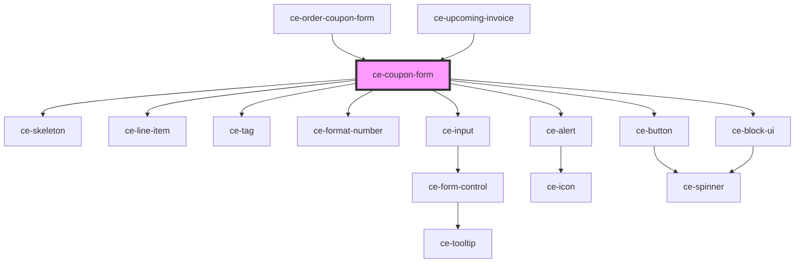

# ce-coupon-form

<!-- Auto Generated Below -->

## Properties

| Property         | Attribute         | Description                   | Type               | Default     |
| ---------------- | ----------------- | ----------------------------- | ------------------ | ----------- |
| `busy`           | `busy`            | Is the form calculating       | `boolean`          | `undefined` |
| `currency`       | `currency`        | Currency                      | `string`           | `undefined` |
| `discount`       | --                | The discount                  | `DiscountResponse` | `undefined` |
| `discountAmount` | `discount-amount` | The discount amount           | `number`           | `undefined` |
| `error`          | `error`           | The error message             | `string`           | `undefined` |
| `forceOpen`      | `force-open`      | Force the form to show        | `boolean`          | `undefined` |
| `label`          | `label`           | The label for the coupon form | `string`           | `undefined` |
| `loading`        | `loading`         | Is the form loading           | `boolean`          | `undefined` |

## Events

| Event           | Description                | Type                  |
| --------------- | -------------------------- | --------------------- |
| `ceApplyCoupon` | When the coupon is applied | `CustomEvent<string>` |

## Dependencies

### Used by

 - [ce-order-coupon-form](../../controllers/checkout-form/order-coupon-form)
 - [ce-upcoming-invoice](../../controllers/dashboard/upcoming-invoice)

### Depends on

- [ce-skeleton](../skeleton)
- [ce-line-item](../line-item)
- [ce-tag](../tag)
- [ce-format-number](../../util/format-number)
- [ce-input](../input)
- [ce-alert](../alert)
- [ce-button](../button)
- [ce-block-ui](../block-ui)

### Graph

----------------------------------------------

*Built with [StencilJS](https://stenciljs.com/)*
