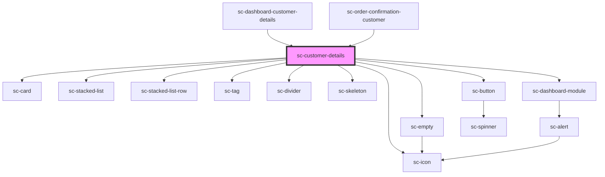

# ce-customer-details

<!-- Auto Generated Below -->

## Properties

| Property   | Attribute   | Description | Type       | Default     |
| ---------- | ----------- | ----------- | ---------- | ----------- |
| `customer` | --          |             | `Customer` | `undefined` |
| `editLink` | `edit-link` |             | `string`   | `undefined` |
| `error`    | `error`     |             | `string`   | `undefined` |
| `heading`  | `heading`   |             | `string`   | `undefined` |
| `loading`  | `loading`   |             | `boolean`  | `undefined` |

## Shadow Parts

| Part                    | Description                |
| ----------------------- | -------------------------- |
| `"base"`                | The elements base wrapper. |
| `"button__base"`        | The button base.           |
| `"button__label"`       | The button label.          |
| `"button__prefix"`      | The button prefix.         |
| `"error__ message"`     | The alert message.         |
| `"error__base"`         | The elements base wrapper. |
| `"error__icon"`         | The alert icon.            |
| `"error__text"`         | The alert text.            |
| `"error__title"`        | The alert title.           |
| `"heading"`             | The heading.               |
| `"heading-description"` | The heading description.   |
| `"heading-text"`        | The heading text wrapper.  |
| `"heading-title"`       | The heading title.         |
| `"test-tag__base"`      | The base test tag.         |
| `"text-tag__content"`   | The base test tag content. |

## Dependencies

### Used by

 - [sc-dashboard-customer-details](../../controllers/dashboard/customer-details)
 - [sc-order-confirmation-customer](../../controllers/confirmation/order-confirmation-customer)

### Depends on

- [sc-card](../card)
- [sc-stacked-list](../stacked-list)
- [sc-stacked-list-row](../stacked-list-row)
- [sc-tag](../tag)
- [sc-divider](../divider)
- [sc-empty](../empty)
- [sc-skeleton](../skeleton)
- [sc-dashboard-module](../dashboard-module)
- [sc-button](../button)
- [sc-icon](../icon)

### Graph

----------------------------------------------

*Built with [StencilJS](https://stenciljs.com/)*
