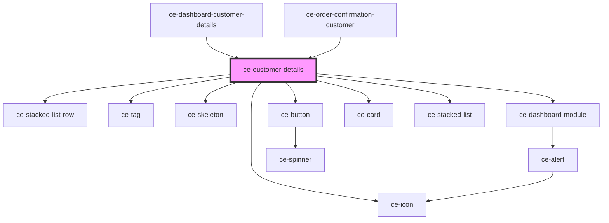

# ce-customer-details

<!-- Auto Generated Below -->

## Properties

| Property   | Attribute   | Description | Type       | Default     |
| ---------- | ----------- | ----------- | ---------- | ----------- |
| `customer` | --          |             | `Customer` | `undefined` |
| `editLink` | `edit-link` |             | `string`   | `undefined` |
| `error`    | `error`     |             | `string`   | `undefined` |
| `heading`  | `heading`   |             | `string`   | `undefined` |
| `loading`  | `loading`   |             | `boolean`  | `undefined` |

## Dependencies

### Used by

 - [ce-dashboard-customer-details](../../controllers/dashboard/customer-details)
 - [ce-order-confirmation-customer](../../controllers/confirmation/order-confirmation-customer)

### Depends on

- [ce-stacked-list-row](../stacked-list-row)
- [ce-tag](../tag)
- [ce-skeleton](../skeleton)
- [ce-dashboard-module](../dashboard-module)
- [ce-button](../button)
- [ce-icon](../icon)
- [ce-card](../card)
- [ce-stacked-list](../stacked-list)

### Graph

----------------------------------------------

*Built with [StencilJS](https://stenciljs.com/)*
