# ce-dashboard-module

<!-- Auto Generated Below -->

## Properties

| Property  | Attribute | Description | Type     | Default     |
| --------- | --------- | ----------- | -------- | ----------- |
| `error`   | `error`   |             | `string` | `undefined` |
| `heading` | `heading` |             | `string` | `undefined` |

## Shadow Parts

| Part                    | Description |
| ----------------------- | ----------- |
| `"heading-description"` |             |
| `"heading-title"`       |             |

## Dependencies

### Used by

 - [sc-charges-list](../../controllers/dashboard/charges-list)
 - [sc-customer-details](../customer-details)
 - [sc-customer-edit](../../controllers/dashboard/customer-edit)
 - [sc-downloads-list](../downloads-list)
 - [sc-invoices-list](../../controllers/dashboard/invoices-list)
 - [sc-order-confirmation](../../controllers/confirmation/order-confirmation)
 - [sc-orders-list](../../controllers/dashboard/orders-list)
 - [sc-payment-methods-list](../../controllers/dashboard/payment-methods-list)
 - [sc-subscription](../../controllers/dashboard/subscription)
 - [sc-subscription-ad-hoc-confirm](../../controllers/dashboard/subscription-ad-hoc-confirm)
 - [sc-subscription-cancel](../../controllers/dashboard/subscription-cancel)
 - [sc-subscription-payment](../../controllers/dashboard/subscription-payment)
 - [sc-subscription-renew](../../controllers/dashboard/subscription-renew)
 - [sc-subscription-switch](../../controllers/dashboard/subscription-switch)
 - [sc-subscriptions-list](../../controllers/dashboard/subscriptions-list)
 - [sc-upcoming-invoice](../../controllers/dashboard/upcoming-invoice)
 - [sc-wordpress-password-edit](../../controllers/dashboard/wordpress-password-edit)
 - [sc-wordpress-user](../../controllers/dashboard/wordpress-user)
 - [sc-wordpress-user-edit](../../controllers/dashboard/wordpress-user-edit)

### Depends on

- [sc-alert](../alert)

### Graph

```mermaid
graph TD;
  sc-dashboard-module --> sc-alert
  sc-alert --> sc-icon
  sc-charges-list --> sc-dashboard-module
  sc-customer-details --> sc-dashboard-module
  sc-customer-edit --> sc-dashboard-module
  sc-downloads-list --> sc-dashboard-module
  sc-invoices-list --> sc-dashboard-module
  sc-order-confirmation --> sc-dashboard-module
  sc-orders-list --> sc-dashboard-module
  sc-payment-methods-list --> sc-dashboard-module
  sc-subscription --> sc-dashboard-module
  sc-subscription-ad-hoc-confirm --> sc-dashboard-module
  sc-subscription-cancel --> sc-dashboard-module
  sc-subscription-payment --> sc-dashboard-module
  sc-subscription-renew --> sc-dashboard-module
  sc-subscription-switch --> sc-dashboard-module
  sc-subscriptions-list --> sc-dashboard-module
  sc-upcoming-invoice --> sc-dashboard-module
  sc-wordpress-password-edit --> sc-dashboard-module
  sc-wordpress-user --> sc-dashboard-module
  sc-wordpress-user-edit --> sc-dashboard-module
  style sc-dashboard-module fill:#f9f,stroke:#333,stroke-width:4px
```

----------------------------------------------

*Built with [StencilJS](https://stenciljs.com/)*
