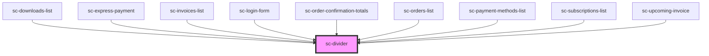

# ce-divider

<!-- Auto Generated Below -->

## Shadow Parts

| Part     | Description |
| -------- | ----------- |
| `"base"` |             |
| `"line"` |             |
| `"text"` |             |

## Dependencies

### Used by

 - [sc-downloads-list](../downloads-list)
 - [sc-express-payment](../../controllers/checkout-form/express-payment)
 - [sc-invoices-list](../../controllers/dashboard/invoices-list)
 - [sc-login-form](../../controllers/login)
 - [sc-order-confirmation-totals](../../controllers/confirmation/order-confirmation-totals)
 - [sc-orders-list](../../controllers/dashboard/orders-list)
 - [sc-payment-methods-list](../../controllers/dashboard/payment-methods-list)
 - [sc-subscriptions-list](../../controllers/dashboard/subscriptions-list)
 - [sc-upcoming-invoice](../../controllers/dashboard/upcoming-invoice)

### Graph

----------------------------------------------

*Built with [StencilJS](https://stenciljs.com/)*
