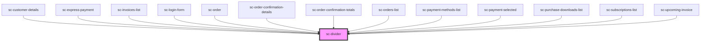

# ce-divider

<!-- Auto Generated Below -->

## Shadow Parts

| Part               | Description                |
| ------------------ | -------------------------- |
| `"base"`           | The elements base wrapper. |
| `"line"`           | The line.                  |
| `"line-container"` | The line container.        |
| `"text"`           | The text.                  |
| `"text-container"` | The text container.        |

## Dependencies

### Used by

 - [sc-customer-details](../customer-details)
 - [sc-express-payment](../../controllers/checkout-form/express-payment)
 - [sc-invoices-list](../../controllers/dashboard/invoices-list)
 - [sc-login-form](../../controllers/login)
 - [sc-order](../../controllers/dashboard/order)
 - [sc-order-confirmation-details](../../controllers/confirmation/order-confirmation-details)
 - [sc-order-confirmation-totals](../../controllers/confirmation/order-confirmation-totals)
 - [sc-orders-list](../../controllers/dashboard/orders-list)
 - [sc-payment-methods-list](../../controllers/dashboard/payment-methods-list)
 - [sc-payment-selected](../payment-selected)
 - [sc-purchase-downloads-list](../purchase-downloads-list)
 - [sc-subscriptions-list](../../controllers/dashboard/subscriptions-list)
 - [sc-upcoming-invoice](../../controllers/dashboard/upcoming-invoice)

### Graph

----------------------------------------------

*Built with [StencilJS](https://stenciljs.com/)*
