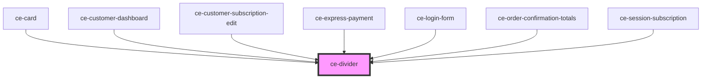

# ce-divider

<!-- Auto Generated Below -->

## Shadow Parts

| Part     | Description |
| -------- | ----------- |
| `"base"` |             |
| `"line"` |             |
| `"text"` |             |

## Dependencies

### Used by

 - [ce-card](../card)
 - [ce-customer-dashboard](../../controllers/dashboard/customer-dashboard)
 - [ce-customer-subscription-edit](../../controllers/dashboard/customer-subscription-edit)
 - [ce-express-payment](../../controllers/express-payment)
 - [ce-login-form](../../controllers/login)
 - [ce-order-confirmation-totals](../../controllers/order-confirmation-totals)
 - [ce-session-subscription](../../controllers/session-subscription)

### Graph

----------------------------------------------

*Built with [StencilJS](https://stenciljs.com/)*
