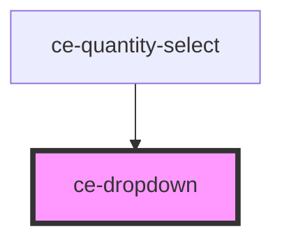

# ce-dropdown

<!-- Auto Generated Below -->

## Properties

| Property        | Attribute         | Description                                                                                       | Type                                                           | Default     |
| --------------- | ----------------- | ------------------------------------------------------------------------------------------------- | -------------------------------------------------------------- | ----------- |
| `clickEl`       | --                |                                                                                                   | `HTMLElement`                                                  | `undefined` |
| `closeOnSelect` | `close-on-select` | Determines whether the dropdown should hide when a menu item is selected                          | `boolean`                                                      | `true`      |
| `open`          | `open`            | Indicates whether or not the dropdown is open. You can use this in lieu of the show/hide methods. | `boolean`                                                      | `false`     |
| `position`      | `position`        | The placement of the dropdown panel                                                               | `"bottom-left" \| "bottom-right" \| "top-left" \| "top-right"` | `undefined` |

## Events

| Event    | Description                                                                                           | Type                |
| -------- | ----------------------------------------------------------------------------------------------------- | ------------------- |
| `ceHide` | Emitted when the dropdown closes. Calling `event.preventDefault()` will prevent it from being closed. | `CustomEvent<void>` |
| `ceShow` | Emitted when the dropdown opens. Calling `event.preventDefault()` will prevent it from being opened.  | `CustomEvent<void>` |

## Shadow Parts

| Part        | Description |
| ----------- | ----------- |
| `"panel"`   |             |
| `"trigger"` |             |

## Dependencies

### Used by

 - [ce-quantity-select](../quantity-select)

### Graph

----------------------------------------------

*Built with [StencilJS](https://stenciljs.com/)*
