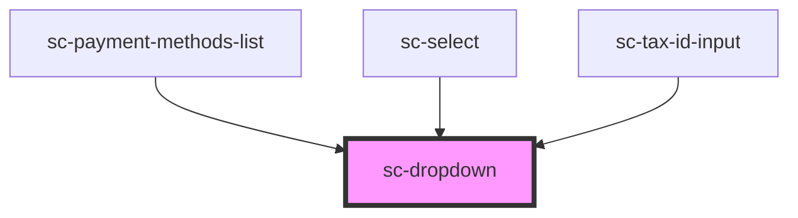

# ce-dropdown

<!-- Auto Generated Below -->

## Properties

| Property        | Attribute         | Description                                                                                                                               | Type                                                                                                                                                                 | Default          |
| --------------- | ----------------- | ----------------------------------------------------------------------------------------------------------------------------------------- | -------------------------------------------------------------------------------------------------------------------------------------------------------------------- | ---------------- |
| `clickEl`       | --                |                                                                                                                                           | `HTMLElement`                                                                                                                                                        | `undefined`      |
| `closeOnSelect` | `close-on-select` | Determines whether the dropdown should hide when a menu item is selected                                                                  | `boolean`                                                                                                                                                            | `true`           |
| `disabled`      | `disabled`        | Is this disabled.                                                                                                                         | `boolean`                                                                                                                                                            | `undefined`      |
| `distance`      | `distance`        | The distance in pixels from which to offset the panel away from its trigger.                                                              | `number`                                                                                                                                                             | `10`             |
| `hoist`         | `hoist`           | Enable this option to prevent the panel from being clipped when the component is placed inside a container with `overflow: auto\|scroll`. | `boolean`                                                                                                                                                            | `false`          |
| `open`          | `open`            | Indicates whether or not the dropdown is open. You can use this in lieu of the show/hide methods.                                         | `boolean`                                                                                                                                                            | `false`          |
| `placement`     | `placement`       | The placement of the dropdown.                                                                                                            | `"bottom" \| "bottom-end" \| "bottom-start" \| "left" \| "left-end" \| "left-start" \| "right" \| "right-end" \| "right-start" \| "top" \| "top-end" \| "top-start"` | `'bottom-start'` |
| `position`      | `position`        | The placement of the dropdown panel                                                                                                       | `"bottom-left" \| "bottom-right" \| "top-left" \| "top-right"`                                                                                                       | `undefined`      |
| `skidding`      | `skidding`        | The distance in pixels from which to offset the panel along its trigger.                                                                  | `number`                                                                                                                                                             | `0`              |

## Events

| Event    | Description                                                                                           | Type                |
| -------- | ----------------------------------------------------------------------------------------------------- | ------------------- |
| `scHide` | Emitted when the dropdown closes. Calling `event.preventDefault()` will prevent it from being closed. | `CustomEvent<void>` |
| `scShow` | Emitted when the dropdown opens. Calling `event.preventDefault()` will prevent it from being opened.  | `CustomEvent<void>` |

## Shadow Parts

| Part        | Description |
| ----------- | ----------- |
| `"panel"`   |             |
| `"trigger"` |             |

## Dependencies

### Used by

 - [sc-payment-methods-list](../../controllers/dashboard/payment-methods-list)
 - [sc-select](../select)
 - [sc-tax-id-input](../tax-id-input)

### Graph

----------------------------------------------

*Built with [StencilJS](https://stenciljs.com/)*
