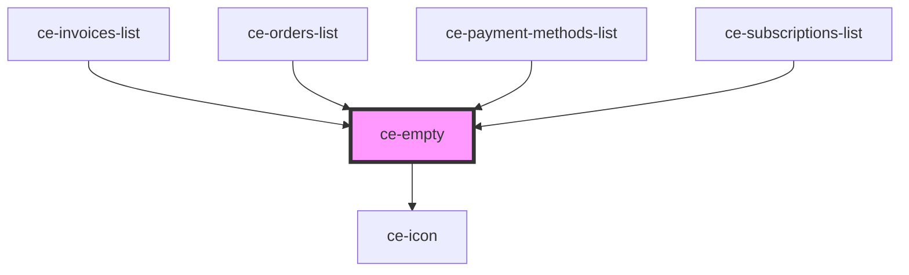

# ce-empty

<!-- Auto Generated Below -->

## Properties

| Property | Attribute | Description | Type     | Default     |
| -------- | --------- | ----------- | -------- | ----------- |
| `icon`   | `icon`    |             | `string` | `undefined` |

## Dependencies

### Used by

 - [ce-invoices-list](../../controllers/dashboard/invoices-list)
 - [ce-orders-list](../../controllers/dashboard/orders-list)
 - [ce-payment-methods-list](../../controllers/dashboard/payment-methods-list)
 - [ce-subscriptions-list](../../controllers/dashboard/subscriptions-list)

### Depends on

- [ce-icon](../icon)

### Graph

----------------------------------------------

*Built with [StencilJS](https://stenciljs.com/)*
