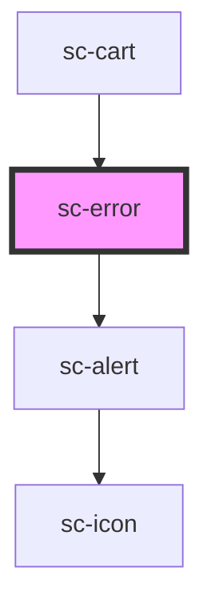

# sc-error

<!-- Auto Generated Below -->

## Properties

| Property | Attribute | Description       | Type            | Default     |
| -------- | --------- | ----------------- | --------------- | ----------- |
| `error`  | --        | Error to display. | `ResponseError` | `undefined` |

## Events

| Event           | Description    | Type                         |
| --------------- | -------------- | ---------------------------- |
| `scUpdateError` | Set the state. | `CustomEvent<ResponseError>` |

## Dependencies

### Used by

 - [sc-cart](../../controllers/cart/sc-cart)

### Depends on

- [sc-alert](../alert)

### Graph

----------------------------------------------

*Built with [StencilJS](https://stenciljs.com/)*
