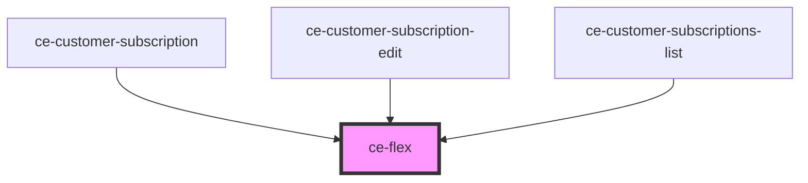

# ce-flex

<!-- Auto Generated Below -->

## Properties

| Property         | Attribute         | Description | Type     | Default     |
| ---------------- | ----------------- | ----------- | -------- | ----------- |
| `alignItems`     | `align-items`     |             | `string` | `undefined` |
| `flexDirection`  | `flex-direction`  |             | `string` | `undefined` |
| `justifyContent` | `justify-content` |             | `string` | `undefined` |

## Dependencies

### Used by

 - [ce-customer-subscription](../../controllers/dashboard/customer-subscription)
 - [ce-customer-subscription-edit](../../controllers/dashboard/customer-subscription-edit)
 - [ce-customer-subscriptions-list](../../controllers/dashboard/customer-subscriptions-list)

### Graph

----------------------------------------------

*Built with [StencilJS](https://stenciljs.com/)*
