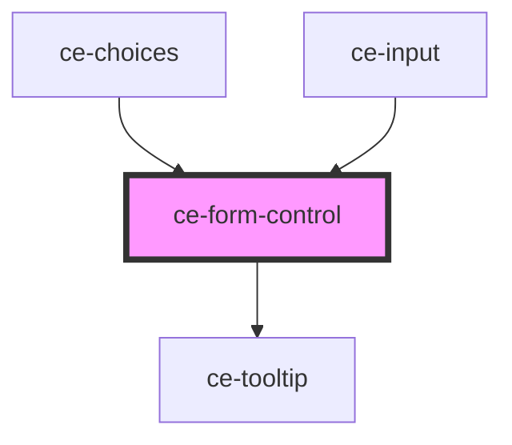

# ce-form-control

<!-- Auto Generated Below -->

## Properties

| Property    | Attribute    | Description                                     | Type                             | Default     |
| ----------- | ------------ | ----------------------------------------------- | -------------------------------- | ----------- |
| `errors`    | `errors`     | Display server-side validation errors.          | `any`                            | `undefined` |
| `help`      | `help`       | Help text                                       | `string`                         | `undefined` |
| `helpId`    | `help-id`    | Help id                                         | `string`                         | `undefined` |
| `inputId`   | `input-id`   | Input id.                                       | `string`                         | `undefined` |
| `label`     | `label`      | Input label.                                    | `string`                         | `undefined` |
| `labelId`   | `label-id`   | Input label id.                                 | `string`                         | `undefined` |
| `name`      | `name`       | Name for the input. Used for validation errors. | `string`                         | `undefined` |
| `required`  | `required`   | Whether the input is required.                  | `boolean`                        | `false`     |
| `showLabel` | `show-label` | Show the label.                                 | `boolean`                        | `true`      |
| `size`      | `size`       | Size of the label                               | `"large" \| "medium" \| "small"` | `'medium'`  |

## Shadow Parts

| Part             | Description |
| ---------------- | ----------- |
| `"form-control"` |             |
| `"help-text"`    |             |
| `"label"`        |             |

## Dependencies

### Used by

 - [ce-choices](../choices)
 - [ce-input](../input)

### Depends on

- [ce-tooltip](../tooltip)

### Graph

----------------------------------------------

*Built with [StencilJS](https://stenciljs.com/)*
