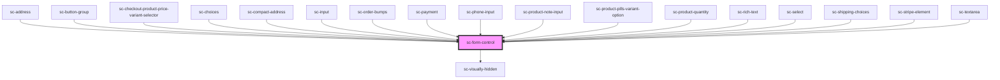

# ce-form-control

<!-- Auto Generated Below -->

## Properties

| Property    | Attribute    | Description                                     | Type                             | Default     |
| ----------- | ------------ | ----------------------------------------------- | -------------------------------- | ----------- |
| `help`      | `help`       | Help text                                       | `string`                         | `undefined` |
| `helpId`    | `help-id`    | Help id                                         | `string`                         | `undefined` |
| `inputId`   | `input-id`   | Input id.                                       | `string`                         | `undefined` |
| `label`     | `label`      | Input label.                                    | `string`                         | `undefined` |
| `labelId`   | `label-id`   | Input label id.                                 | `string`                         | `undefined` |
| `name`      | `name`       | Name for the input. Used for validation errors. | `string`                         | `undefined` |
| `required`  | `required`   | Whether the input is required.                  | `boolean`                        | `false`     |
| `showLabel` | `show-label` | Show the label.                                 | `boolean`                        | `true`      |
| `size`      | `size`       | Size of the label                               | `"large" \| "medium" \| "small"` | `'medium'`  |

## Shadow Parts

| Part             | Description                |
| ---------------- | -------------------------- |
| `"form-control"` | The elements base wrapper. |
| `"help-text"`    | Help text.                 |
| `"input"`        | The input wrapper.         |
| `"label"`        | The label.                 |
| `"tooltip"`      | Tooltip                    |
| `"tooltip-text"` | Tooltip text.              |

## Dependencies

### Used by

 - [sc-address](../address)
 - [sc-button-group](../sc-button-group)
 - [sc-checkout-product-price-variant-selector](../../controllers/checkout-form/sc-checkout-product-price-variant-selector)
 - [sc-choices](../choices)
 - [sc-compact-address](../sc-compact-address)
 - [sc-input](../input)
 - [sc-order-bumps](../../controllers/checkout-form/sc-order-bumps)
 - [sc-payment](../../controllers/checkout-form/payment)
 - [sc-phone-input](../phone-input)
 - [sc-product-note-input](../../controllers/product/sc-product-note-input)
 - [sc-product-pills-variant-option](../../controllers/product/sc-product-pills-variant-option)
 - [sc-product-quantity](../../controllers/product/sc-product-quantity)
 - [sc-rich-text](../rich-text)
 - [sc-select](../select)
 - [sc-shipping-choices](../sc-shipping-choices)
 - [sc-stripe-element](../stripe-element)
 - [sc-textarea](../sc-textarea)

### Depends on

- [sc-visually-hidden](../../util/visually-hidden)

### Graph

----------------------------------------------

*Built with [StencilJS](https://stenciljs.com/)*
