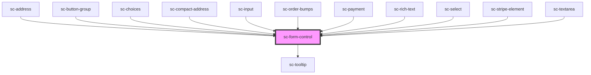

# ce-form-control

<!-- Auto Generated Below -->

## Properties

| Property       | Attribute       | Description                                     | Type                             | Default     |
| -------------- | --------------- | ----------------------------------------------- | -------------------------------- | ----------- |
| `errorMessage` | `error-message` | Store the error message                         | `string`                         | `undefined` |
| `errors`       | `errors`        | Display server-side validation errors.          | `any`                            | `undefined` |
| `help`         | `help`          | Help text                                       | `string`                         | `undefined` |
| `helpId`       | `help-id`       | Help id                                         | `string`                         | `undefined` |
| `inputId`      | `input-id`      | Input id.                                       | `string`                         | `undefined` |
| `label`        | `label`         | Input label.                                    | `string`                         | `undefined` |
| `labelId`      | `label-id`      | Input label id.                                 | `string`                         | `undefined` |
| `name`         | `name`          | Name for the input. Used for validation errors. | `string`                         | `undefined` |
| `required`     | `required`      | Whether the input is required.                  | `boolean`                        | `false`     |
| `showLabel`    | `show-label`    | Show the label.                                 | `boolean`                        | `true`      |
| `size`         | `size`          | Size of the label                               | `"large" \| "medium" \| "small"` | `'medium'`  |

## Shadow Parts

| Part             | Description                |
| ---------------- | -------------------------- |
| `"form-control"` | The elements base wrapper. |
| `"help-text"`    | Help text.                 |
| `"input"`        | The input wrapper.         |
| `"label"`        | The label.                 |
| `"tooltip"`      | Tooltip                    |
| `"tooltip-text"` | Tooltip text.              |

## Dependencies

### Used by

 - [sc-address](../address)
 - [sc-button-group](../sc-button-group)
 - [sc-choices](../choices)
 - [sc-compact-address](../sc-compact-address)
 - [sc-input](../input)
 - [sc-order-bumps](../../controllers/checkout-form/sc-order-bumps)
 - [sc-payment](../../controllers/checkout-form/payment)
 - [sc-rich-text](../rich-text)
 - [sc-select](../select)
 - [sc-stripe-element](../stripe-element)
 - [sc-textarea](../sc-textarea)

### Depends on

- [sc-tooltip](../tooltip)

### Graph

----------------------------------------------

*Built with [StencilJS](https://stenciljs.com/)*
