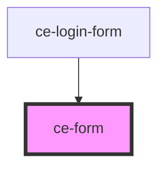

# ce-form

<!-- Auto Generated Below -->

## Properties

| Property     | Attribute    | Description                                                | Type      | Default |
| ------------ | ------------ | ---------------------------------------------------------- | --------- | ------- |
| `novalidate` | `novalidate` | Prevent the form from validating inputs before submitting. | `boolean` | `false` |

## Events

| Event          | Description                                                                                                                                                                                                                                                                                                                                                                                                | Type                  |
| -------------- | ---------------------------------------------------------------------------------------------------------------------------------------------------------------------------------------------------------------------------------------------------------------------------------------------------------------------------------------------------------------------------------------------------------- | --------------------- |
| `ceFormChange` | Emitted when the form is submitted. This event will not be emitted if any form control inside of it is in an invalid state, unless the form has the `novalidate` attribute. Note that there is never a need to prevent this event, since it doen't send a GET or POST request like native forms. To "prevent" submission, use a conditional around the XHR request you use to submit the form's data with. | `CustomEvent<Object>` |
| `ceFormSubmit` | Emitted when the form is submitted. This event will not be emitted if any form control inside of it is in an invalid state, unless the form has the `novalidate` attribute. Note that there is never a need to prevent this event, since it doen't send a GET or POST request like native forms. To "prevent" submission, use a conditional around the XHR request you use to submit the form's data with. | `CustomEvent<void>`   |

## Methods

### `getFormData() => Promise<FormData>`

Serializes all form controls elements and returns a `FormData` object.

#### Returns

Type: `Promise<FormData>`

### `getFormJson() => Promise<Record<string, unknown>>`

#### Returns

Type: `Promise<Record<string, unknown>>`

### `submit() => Promise<void>`

#### Returns

Type: `Promise<void>`

## Shadow Parts

| Part     | Description |
| -------- | ----------- |
| `"base"` |             |

## Dependencies

### Used by

 - [ce-login-form](../../controllers/login)

### Graph

----------------------------------------------

*Built with [StencilJS](https://stenciljs.com/)*
