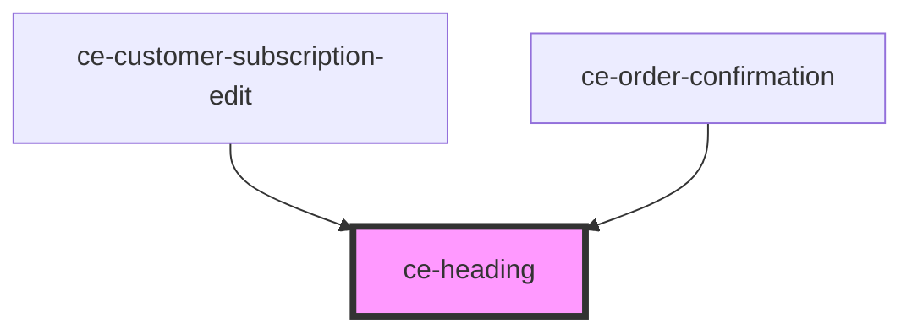

# ce-heading

<!-- Auto Generated Below -->

## Properties

| Property | Attribute | Description | Type                             | Default    |
| -------- | --------- | ----------- | -------------------------------- | ---------- |
| `size`   | `size`    |             | `"large" \| "medium" \| "small"` | `'medium'` |

## Shadow Parts

| Part     | Description |
| -------- | ----------- |
| `"base"` |             |

## Dependencies

### Used by

 - [ce-customer-subscription-edit](../../controllers/dashboard/subscription-detail)
 - [ce-order-confirmation](../../controllers/order-confirmation)

### Graph

----------------------------------------------

*Built with [StencilJS](https://stenciljs.com/)*
