# ce-register-icon-library

<!-- Auto Generated Below -->

## Properties

| Property  | Attribute | Description                                                                                                   | Type     | Default     |
| --------- | --------- | ------------------------------------------------------------------------------------------------------------- | -------- | ----------- |
| `label`   | `label`   | An alternative description to use for accessibility. If omitted, the name or src will be used to generate it. | `string` | `undefined` |
| `library` | `library` | The name of a registered custom icon library.                                                                 | `string` | `'default'` |
| `name`    | `name`    | The name of the icon to draw.                                                                                 | `string` | `undefined` |
| `src`     | `src`     | An external URL of an SVG file.                                                                               | `string` | `undefined` |

## Events

| Event     | Description                           | Type                               |
| --------- | ------------------------------------- | ---------------------------------- |
| `scError` | Emitted when the icon failed to load. | `CustomEvent<{ status: number; }>` |
| `scLoad`  | Emitted when the icon has loaded.     | `CustomEvent<void>`                |

## Shadow Parts

| Part     | Description |
| -------- | ----------- |
| `"base"` |             |

## Dependencies

### Used by

 - [sc-alert](../alert)
 - [sc-breadcrumb](../breadcrumb)
 - [sc-breadcrumbs](../breadcrumbs)
 - [sc-cart-header](../../controllers/cart/cart-header)
 - [sc-cart-icon](../sc-cart-icon)
 - [sc-cart-submit](../../controllers/cart/cart-submit)
 - [sc-cc-logo](../cc-logo)
 - [sc-charges-list](../../controllers/dashboard/charges-list)
 - [sc-customer-details](../customer-details)
 - [sc-dialog](../sc-dialog)
 - [sc-downloads-list](../downloads-list)
 - [sc-drawer](../sc-drawer)
 - [sc-empty](../empty)
 - [sc-invoices-list](../../controllers/dashboard/invoices-list)
 - [sc-login-form](../../controllers/login)
 - [sc-order-submit](../../controllers/checkout-form/order-submit)
 - [sc-orders-list](../../controllers/dashboard/orders-list)
 - [sc-payment](../../controllers/checkout-form/payment)
 - [sc-payment-methods-list](../../controllers/dashboard/payment-methods-list)
 - [sc-product-line-item](../product-line-item)
 - [sc-quantity-select](../quantity-select)
 - [sc-select](../select)
 - [sc-subscription](../../controllers/dashboard/subscription)
 - [sc-subscription-ad-hoc-confirm](../../controllers/dashboard/subscription-ad-hoc-confirm)
 - [sc-subscription-switch](../../controllers/dashboard/subscription-switch)
 - [sc-subscriptions-list](../../controllers/dashboard/subscriptions-list)
 - [sc-tax-id-input](../tax-id-input)
 - [sc-toggle](../sc-toggle)
 - [sc-upcoming-invoice](../../controllers/dashboard/upcoming-invoice)
 - [sc-wordpress-user](../../controllers/dashboard/wordpress-user)

### Graph

```mermaid
graph TD;
  sc-alert --> sc-icon
  sc-breadcrumb --> sc-icon
  sc-breadcrumbs --> sc-icon
  sc-cart-header --> sc-icon
  sc-cart-icon --> sc-icon
  sc-cart-submit --> sc-icon
  sc-cc-logo --> sc-icon
  sc-charges-list --> sc-icon
  sc-customer-details --> sc-icon
  sc-dialog --> sc-icon
  sc-downloads-list --> sc-icon
  sc-drawer --> sc-icon
  sc-empty --> sc-icon
  sc-invoices-list --> sc-icon
  sc-login-form --> sc-icon
  sc-order-submit --> sc-icon
  sc-orders-list --> sc-icon
  sc-payment --> sc-icon
  sc-payment-methods-list --> sc-icon
  sc-product-line-item --> sc-icon
  sc-quantity-select --> sc-icon
  sc-select --> sc-icon
  sc-subscription --> sc-icon
  sc-subscription-ad-hoc-confirm --> sc-icon
  sc-subscription-switch --> sc-icon
  sc-subscriptions-list --> sc-icon
  sc-tax-id-input --> sc-icon
  sc-toggle --> sc-icon
  sc-upcoming-invoice --> sc-icon
  sc-wordpress-user --> sc-icon
  style sc-icon fill:#f9f,stroke:#333,stroke-width:4px
```

----------------------------------------------

*Built with [StencilJS](https://stenciljs.com/)*
